::: {.callout-warning title="Work in progress"}
This is a classroom draft. Test the steps with students and record anything that needs revision.
:::

## Make your mark

Draw a simple personal mark on paper, take a clear photograph or scan, and use that image as a tracing reference in Photopea. The finished logo should use **your initials, two or three meaningful shapes, or both**.

## Choose what you need

:::: {.ter-resource-grid}
::: {.ter-resource-card}
### Student: complete the lesson online

Stay on this webpage. It contains the complete sequence, examples, and Photopea screenshots.

[Start with Step 1](#start-with-an-idea){.btn .btn-primary}
:::

::: {.ter-resource-card}
### Teacher: edit or assign the worksheet

Use the Google Doc when you want to adapt the wording, add class instructions, or assign a digital copy.

[Teacher worksheet in Google Docs](https://docs.google.com/document/d/1amzmA_uCjCnRD1YX1KIoW8YhIvRrl10hZQvdADdNV8Y/edit){.btn .btn-primary}
:::

::: {.ter-resource-card}
### Print a handout for drawing

Use this two-page PDF when students will analyse the example and sketch three logo ideas by hand.

[Print the two-page sketch worksheet (PDF)](../../assets/name-tag-photopea/personal-logo-worksheet.pdf){.btn .btn-primary}
:::

::: {.ter-resource-card}
### Follow the Photopea steps separately

Use the Google Doc on a screen, or print the PDF. Both contain the same step-by-step screenshots.

[Photopea guide in Google Docs](https://docs.google.com/document/d/14Tu-Nq394PJ6q7XqGiKx-N0yA6PrIBK4M53pB01OFHw/edit){.btn .btn-primary}
[Print the Photopea guide (PDF)](../../assets/name-tag-photopea/personal-logo-photopea-guide.pdf){.btn .btn-outline-primary}
:::
::::

{fig-alt="A paper landscape sketch is reduced to a sun, mountain, and river, rebuilt with simple shapes in Photopea, and finished as an original coloured logo."}

## 1. Start with an idea

1. Think of a place, object, activity, or set of initials that represents you.
2. Draw it quickly on plain white paper with a dark pencil or marker.
3. Circle **two or three shapes** that carry the meaning.
4. Leave small details behind. You will trace the useful structure, not every pencil mark.

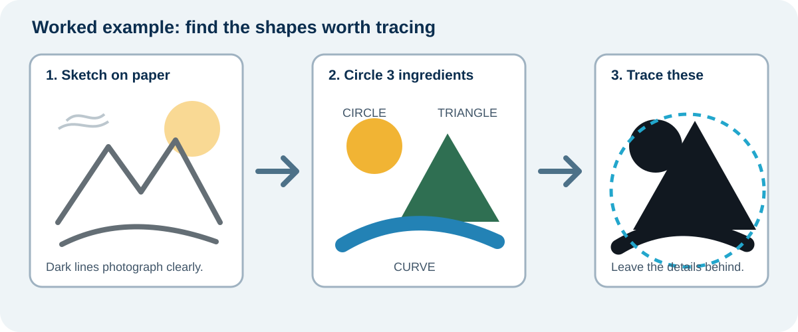{fig-alt="A paper landscape sketch is photographed, then its circle, triangle, and curved river are selected as the useful logo ingredients."}

**Example:** The landscape sketch contains many marks, but the logo only needs a circle for the sun, a triangle for the mountain, and one curve for the river.

## 2. Sketch three different ideas

Use the worksheet and draw three quick possibilities. Change the idea, not only the size.

1. **Initials only:** combine or overlap your letters.
2. **Shapes only:** use the strongest shapes from your paper sketch.
3. **Initials + one shape:** connect one meaningful shape to your letters.

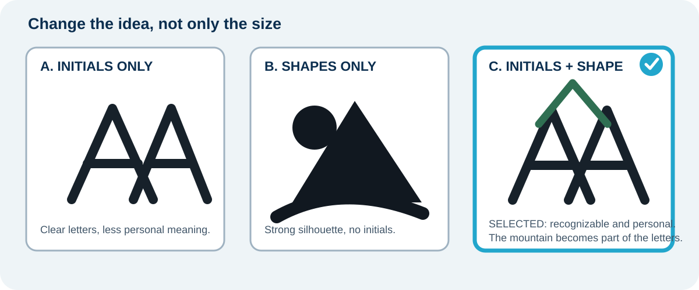{fig-alt="Three labelled student sketch examples compare initials only, landscape shapes only, and initials plus one landscape shape. The combined option is selected because it has the clearest silhouette."}

Choose the idea that is easiest to recognize in one second. A clear silhouette is more useful than extra detail.

## 3. Know the file types

<figure>
  
  <figcaption><strong>Raster:</strong> pixels, such as a phone photograph, JPG, or PNG. <strong>Vector:</strong> paths, such as SVG. Image: <a href="https://commons.wikimedia.org/wiki/File:Bitmap_VS_SVG.svg">Yug, Wikimedia Commons</a>, CC BY-SA 2.5.</figcaption>
</figure>

Your photograph or scan is a raster **reference**. You will trace it with clean Photopea shapes and export an **SVG** master. Keep a transparent PNG copy for the name tag.

## 4. Trace and rebuild the sketch in Photopea

The six screenshots below are the complete visual walkthrough from the Google Doc. The Photopea advertising rail has been cropped out so every image focuses on the student action.

::: {.callout-tip title="Keep the visual guide beside Photopea"}
Keep this webpage or the separate Photopea guide beside the editor. Stop after each image and compare your screen with the checkpoint before continuing.
:::

### Step 1 - Create a square logo file

1. Open [Photopea](https://www.photopea.com/) and choose **File > New**.
2. Set **Width: 1000 px**, **Height: 1000 px**, and **Background: Transparent**. Select **Create**.

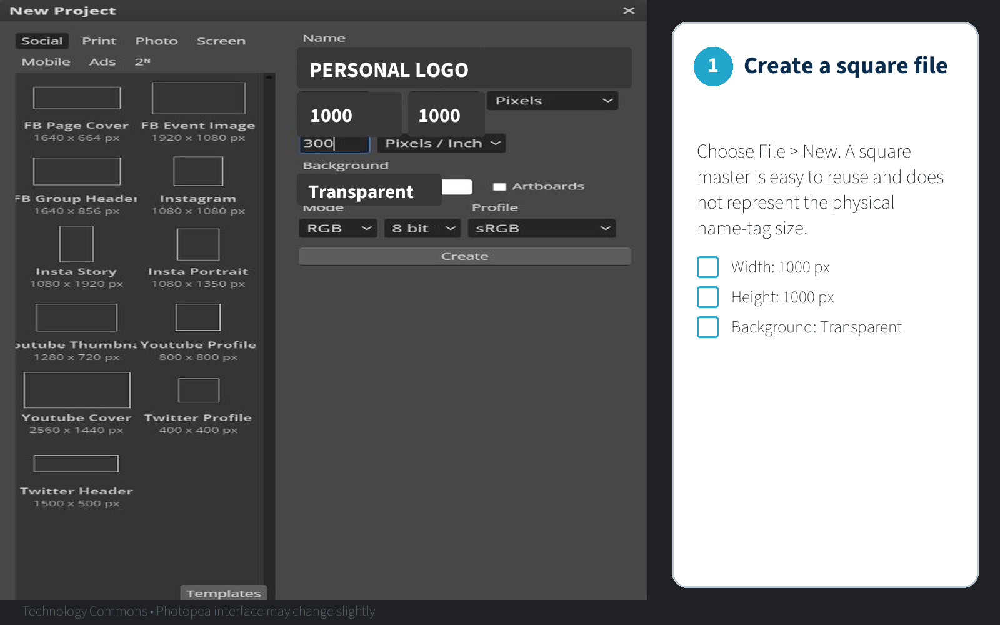{fig-alt="A clean Photopea New Project screen shows a 1000 by 1000 pixel transparent document and a three-item checkpoint list. No advertising rail is visible."}

Use pixels for this scale-free logo master because it does not represent the physical name-tag size. You will use **inches** when you place the logo on the 11 × 4 inch name-tag canvas.

### Step 2 - Place your photograph or scan

1. Photograph the sketch straight on in bright, even light, or scan it.
2. Choose **File > Open & Place** and select the image.
3. Hold the aspect ratio lock and resize the sketch to fill most of the square.
4. In the **Layers** panel, rename the placed layer `REFERENCE`.

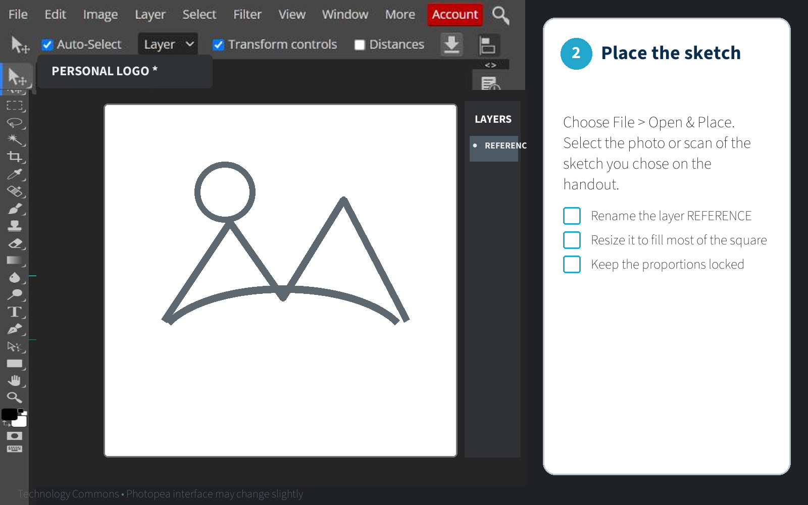{fig-alt="A clean Photopea workspace shows a simple landscape sketch placed on a layer named REFERENCE. No advertising rail is visible."}

### Step 3 - Fade and lock the reference

1. Select the `REFERENCE` layer.
2. Set its **Opacity to 30%**.
3. Select the lock icon so the photograph cannot move.
4. Never draw on the `REFERENCE` layer.

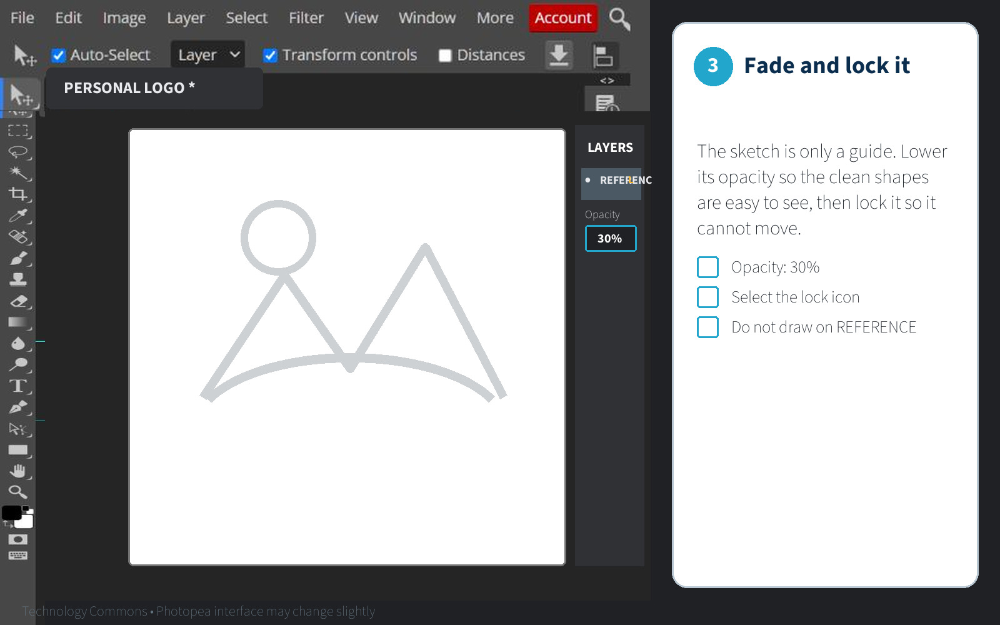{fig-alt="A clean Photopea workspace shows the paper sketch faded to 30 percent opacity and locked on the REFERENCE layer."}

### Step 4 - Trace with clean shapes

1. Select **New Layer** and name the first part, such as `SUN`, `MOUNTAIN`, `RIVER`, or `INITIALS`.
2. Press **U** for a Shape tool. Set **Fill to black** and **Stroke to none**. Draw circles, rectangles, or polygons over the photograph.
3. Press **P** for the Pen tool when you need a custom shape. Click for straight corners. Click and drag only for curves. Close the path by clicking its first point.
4. Press **T** for the Type tool if your logo uses initials. Choose a bold, readable sans-serif font and keep the text editable while you test.
5. Press **V** for the Move tool. Use **Ctrl+T** to resize, rotate, or move the selected part. Keep the proportions locked.

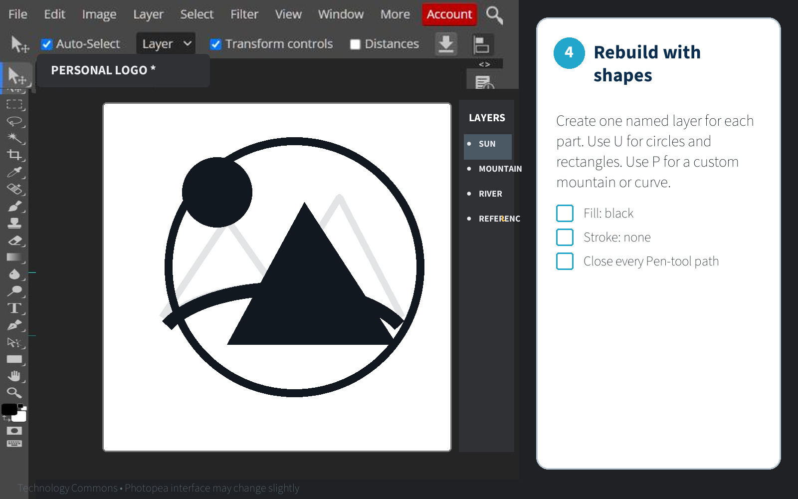{fig-alt="A clean Photopea workspace shows a sun, mountain, and river traced as bold black shapes on separate named layers above the faded reference photograph."}

::: {.callout-note title="If you begin with lettering"}
Keep one editable text layer. Duplicate it before choosing **Convert to Shape**. Never convert your only editable text layer.
:::

::: {.callout-note title="If the photograph has too much detail"}
Crop it, increase the contrast, and trace only the strongest edges. **Image > Vectorize Bitmap** can give you a starting point, but remove bumps, tiny pieces, and unwanted holes afterward.
:::

### Step 5 - Hide the photograph and run the black test

1. Hide `REFERENCE` by selecting its eye icon.
2. Group or clearly name the traced layers.
3. Zoom out until the mark appears about **25 mm wide** on screen.
4. Remove anything that disappears, closes up, or becomes confusing.

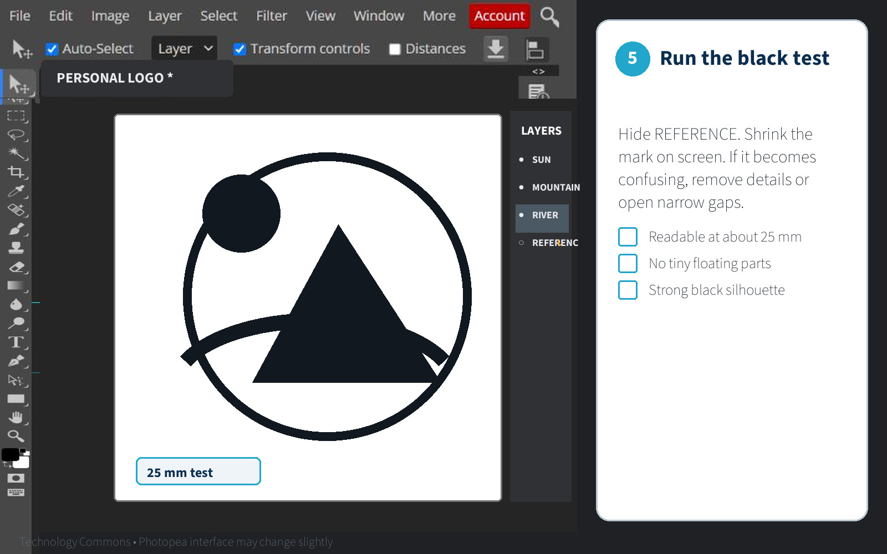{fig-alt="A clean Photopea workspace shows the reference photograph hidden and the traced logo tested as a strong black silhouette at a small size."}

## 5. Add simple colour

Add colour only after the black silhouette works. Use **two or three colours at most**: one main colour, one supporting colour, and an optional accent.

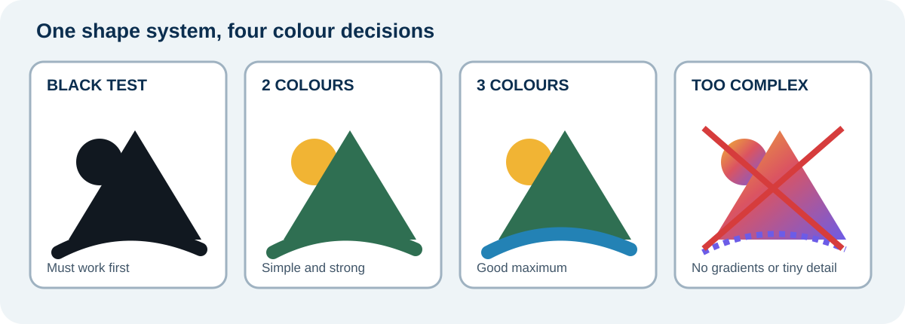{fig-alt="The same mountain logo appears as a strong black silhouette, a simple two-colour version, and a three-colour version. An overly detailed gradient version is marked as unsuitable."}

- Keep strong light-dark contrast.
- Keep a black version for engraving.
- Avoid gradients and tiny coloured details in the first version.
- Do not use colour to repair an unclear silhouette.

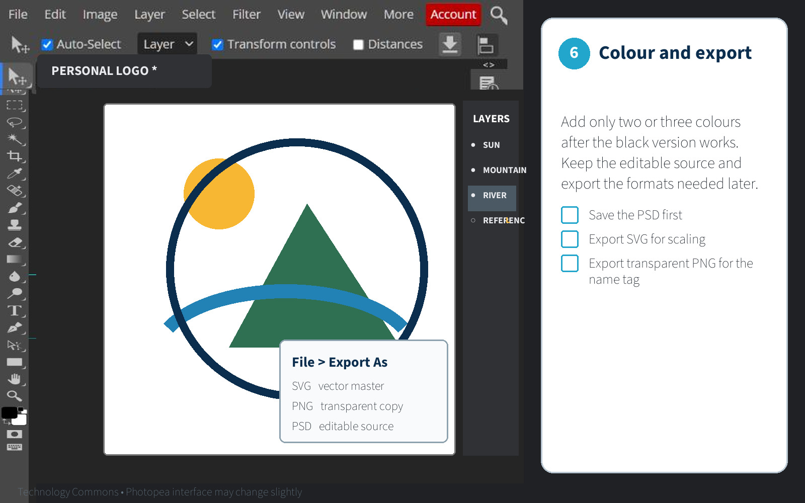{fig-alt="A clean Photopea workspace shows the logo with three flat colours and a reminder to save PSD, SVG, and transparent PNG files."}

## 6. Run four quick tests

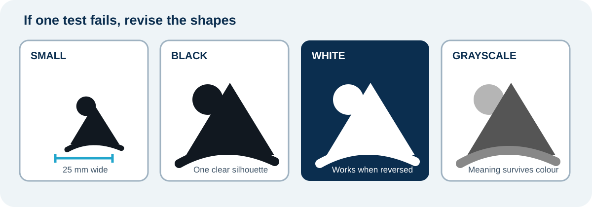{fig-alt="Four examples show the logo at 25 millimetres, as a black silhouette, reversed in white on a dark field, and in grayscale."}

- **Small:** is it recognizable at about 25 mm wide?
- **Black:** does the silhouette still work?
- **White:** does it work on a dark background?
- **Grayscale:** does the idea survive without colour?

If a thin line disappears, thicken it. If a small gap closes, open it. If the mark needs colour to make sense, simplify it.

## 7. Save the logo system

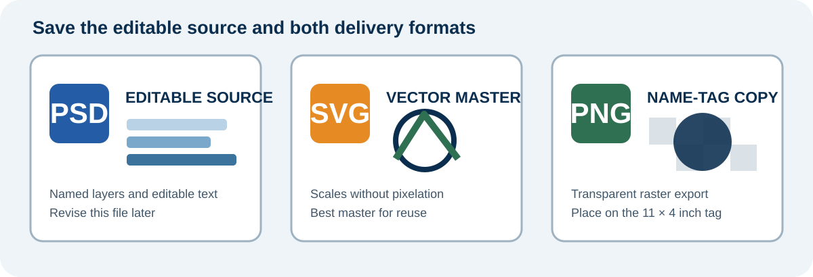{fig-alt="Three file cards show an editable layered PSD, a scalable SVG master, and a transparent PNG copy for the name-tag project."}

Save:

- editable `lastname-logo-master.psd`
- `lastname-logo-colour.svg`
- `lastname-logo-dark.svg`
- `lastname-logo-light.svg`
- `lastname-logo-gray.svg`
- transparent `lastname-logo.png`

Choose **File > Export As > SVG** for the vector master. Keep the PSD so you can revise it. Export the transparent PNG for the name tag.

Before submitting, reopen both the SVG and PNG in Photopea. Check the shapes, spelling, transparent background, and canvas edges.

::: {.callout-tip title="Ready for the name tag?"}
Bring the transparent PNG and editable PSD to the [Name + Logo engraving worksheet](../03-laser-cutting/01-name-logo.qmd). The name-tag file is built at **11 × 4 inches**, not as a pixel-only canvas.
:::

::: {.ter-curriculum-relevance}
**Ontario curriculum relevance:** Strongly relevant to **TGJ2O Communications Technology** and useful in **TDJ2O** and **TIJ1O** work involving visual identity, vector graphics, design alternatives, and fabrication.
:::

Next: [Name + Logo Wood Name Tag](../03-laser-cutting/01-name-logo.qmd).
