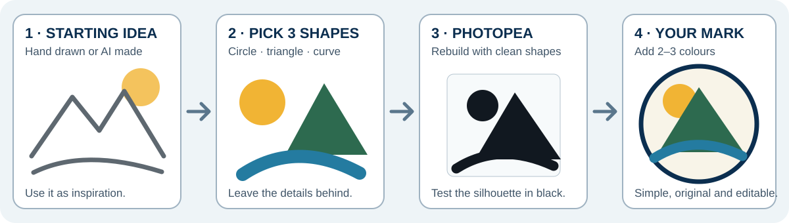

::: {.callout-warning title="Work in progress"}
This is a classroom draft. Test the steps with students and record anything that needs revision.
:::

## Make your mark

Create a simple personal mark from **your initials, a landscape idea, or both**. Your starting image may be hand drawn or created with an approved AI image tool. The finished logo must be your own simplified design.

[Download the one-page personal-logo worksheet](../../assets/name-tag-photopea/personal-logo-worksheet.pdf){.btn .btn-primary}

{fig-alt="A hand-drawn or AI-made landscape reference is reduced to a sun, mountain, and river, rebuilt with simple shapes in Photopea, and finished as an original coloured logo."}

## 1. Start with an idea

Use either:

- your own quick drawing; or
- an approved AI-made image created from your own prompt.

Do **not** trace every detail. Circle only **two or three useful ingredients**, such as a mountain triangle, a sun circle, a river curve, or your initials.

## 2. Sketch three different ideas

Use the worksheet. Draw three simple marks quickly.

1. **Initials only**
2. **Landscape shapes only**
3. **Initials + one landscape shape**

Choose the idea with the clearest silhouette, not the most detail.

## 3. Know the file types

<figure>
  
  <figcaption><strong>Raster:</strong> pixels, such as JPG and PNG. <strong>Vector:</strong> paths, such as SVG. Image: <a href="https://commons.wikimedia.org/wiki/File:Bitmap_VS_SVG.svg">Yug, Wikimedia Commons</a>, CC BY-SA 2.5.</figcaption>
</figure>

For this logo, keep the editable Photopea file and export an **SVG** master. A PNG copy is useful later for engraving.

## 4. Rebuild it in Photopea

1. Open [Photopea](https://www.photopea.com/).
2. Choose **File > New**.
3. Enter **1000 × 1000 px**.
4. Choose **Transparent**.
5. Place the inspiration image as a reference layer.
6. Lower its opacity and lock it.
7. Rebuild the idea with the **Shape**, **Pen**, and **Type** tools.
8. Hide the reference. The new mark should still make sense.

Start with black shapes. This makes weak shapes easy to see.

### If you start with type

1. Keep one editable text layer.
2. Duplicate it.
3. Right-click the copy and choose **Convert to Shape**.
4. Move, overlap, rotate, or combine the shapes.

### If you start with a drawing

1. Photograph it straight on in bright, even light.
2. Crop and increase the contrast.
3. Choose **Image > Vectorize Bitmap**.
4. Use very few colours.
5. Remove bumps, tiny pieces, and unwanted holes.

## 5. Add simple colour

Use **two or three colours at most**. Choose one main colour, one supporting colour, and an optional accent.

- Keep strong light-dark contrast.
- Do not use colour to hide an unclear shape.
- Keep a black version for engraving.
- Avoid gradients and tiny coloured details for the first version.

Colour can add mood: warm colours may feel energetic, while blues and greens may feel calm or connected to land and water. These are choices, not fixed rules.

## 6. Run four quick tests

- **Small:** is it recognizable at about 25 mm wide?
- **Black:** does the silhouette still work?
- **White:** does it work on a dark background?
- **Grayscale:** does the idea survive without colour?

If a thin line disappears, thicken it. If a small gap closes, open it. If the mark needs colour to make sense, simplify it.

## 7. Save the logo system

Save:

- editable `lastname-logo-master.psd`
- `lastname-logo-colour.svg`
- `lastname-logo-dark.svg`
- `lastname-logo-light.svg`
- `lastname-logo-gray.svg`
- transparent `lastname-logo.png`

Choose **File > Export As > SVG** for the vector master. Keep the PSD so you can revise it.

::: {.callout-tip title="Ready for the name tag?"}
Bring the transparent PNG and the editable PSD to the [Name + Logo engraving worksheet](../03-laser-cutting/01-name-logo.qmd). You will test the proportions on paper before building the final file.
:::

::: {.ter-curriculum-relevance}
**Ontario curriculum relevance:** Strongly relevant to **TGJ2O Communications Technology** and useful in **TDJ2O** and **TIJ1O** work involving visual identity, vector graphics, design alternatives, and fabrication.
:::

Next: [Name + Logo Wood Name Tag](../03-laser-cutting/01-name-logo.qmd).
