::: {.callout-warning title="Work in progress"}
This worksheet is an evolving classroom draft. Confirm measurements, machine settings, material approval, and the instructor's local laser procedure before fabrication. Record anything that needs revision after the first student test.
:::

::: {.ter-project-brief}
## Design brief

Create a clean engraving file for a **teacher-supplied, pre-cut 11 × 4 inch wood name-tag blank**. Place a transparent PNG logo, add a readable name, keep intentional space around every element, and export one full-size PNG for engraving. The example uses the Technology Commons emblem, Andrew's AA lettermark, and **NDRADE**, so the AA mark acts as the first A in **ANDRADE**.
:::

## Learning goals

By the end, you can:

- explain what a raster image is;
- choose between JPG, PNG, WebP, and SVG for a specific job;
- recognize transparency and explain why it matters;
- create an 11 × 4 inch canvas at 300 pixels per inch;
- use guides to create a 0.25 inch safe margin;
- arrange a logo and name with readable typography, balanced spacing, and clear hierarchy;
- save an editable master and export a checked PNG for engraving.

## Part 1 - Raster images and PNG

### What is a raster image?

A raster image is a grid of tiny coloured squares called **pixels**. Zoom in far enough and the edges become blocky because the software is enlarging those squares. Photographs, screenshots, JPG files, PNG files, and most WebP files are raster images.

A vector graphic stores shapes as mathematical paths. It can scale up without becoming pixelated. SVG is a common vector format and is especially useful when exact outlines will become laser cut paths. In this project, the finished machine handoff is a raster PNG because the first operation is **engrave only**, not a vector cut.

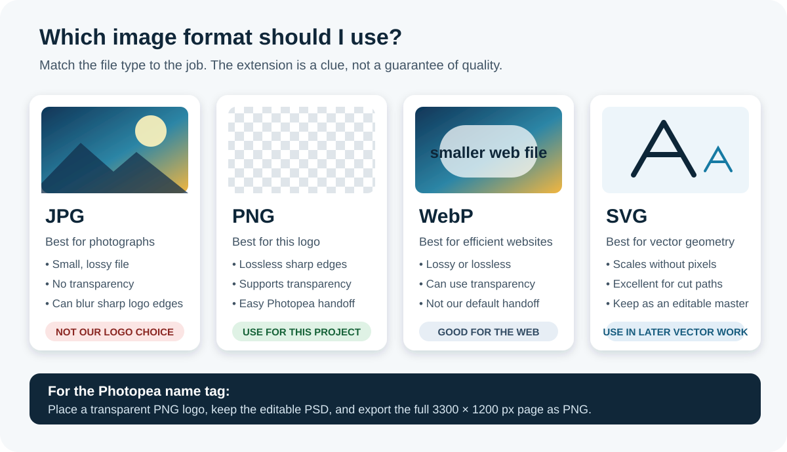{fig-alt="Four illustrated cards compare JPG for photographs, PNG for a transparent logo, WebP for efficient websites, and SVG for scalable vector geometry."}

### Which format should I use?

| Format | What it does well | Important limitation | Use here? |
|---|---|---|---|
| **JPG / JPEG** | Photographs and smooth colour changes at a small file size | Lossy compression can make sharp logo edges fuzzy, and JPG has no transparent background | No |
| **PNG** | Sharp-edged artwork, lossless compression, and full alpha transparency | Often larger than JPG or WebP for photographs | **Yes** |
| **WebP** | Efficient website images; can be lossy, lossless, or transparent | It is not our standard classroom laser handoff | Not for this submission |
| **SVG** | Logos, icons, diagrams, and cut geometry that must stay sharp at any size | It is a vector file, not the raster engraving image requested here | Keep as an editable source when available |

The [MDN image format guide](https://developer.mozilla.org/en-US/docs/Web/Media/Guides/Formats/Image_types) documents these differences. Photopea can open and export many of these formats, but the file type should follow the job, not habit.

### Why use a transparent PNG logo?

Transparency means the pixels around the logo are empty rather than filled with a white rectangle. Photopea displays transparency as a grey-and-white checkerboard. A transparent logo can sit over the page without bringing an unwanted box with it.

::: {.columns}
::: {.column width="50%"}
#### Transparent PNG

The checkerboard is not part of the image. It shows the empty pixels around the AA mark.
:::
::: {.column width="50%"}
#### White-box problem

If a logo arrives with a white background, that rectangle becomes part of the artwork. Do not assume white means transparent.
:::
:::

**Quick transparency check:** open the logo by itself in Photopea. Checkerboard around the mark means transparent. Solid white around it means those are actual white pixels.

## Part 2 - Build the 11 × 4 inch name tag in Photopea

### Before you start

Use [Photopea](https://www.photopea.com/) in a modern browser. Download the instructor-approved transparent PNG logo before opening the editor. For the worked example, use:

- [Technology Commons transparent emblem](../../assets/branding/emblem/commons-emblem-monochrome-blue-transparent.png)
- [AA transparent lettermark](../../assets/branding/logo/aa-logo-transparent.png)

Record your plan:

| Decision | Your answer |
|---|---|
| Name to display | ______________________________________________ |
| Logo file | ______________________________________________ |
| Typeface and weight | ______________________________________________ |
| Visual priority: logo, name, or equal | ______________________________________________ |

### Step 0 - Make a paper prototype

A letter-size sheet is 11 × 8.5 inches. Cut it lengthwise and trim the outside quarter-inch strips to make **two exact 11 × 4 inch prototypes**.

[Download the full-size paper prototype sheet](../../assets/name-tag-photopea/name-tag-paper-prototype.pdf){.btn .btn-primary}

1. Print in landscape at **Actual size / 100%**. Do not choose Fit.
2. Measure the 1 inch check line with a ruler.
3. Cut on the solid lines.
4. Sketch the logo and name inside the dashed safe margin.
5. Put the logo and name on one horizontal centreline.
6. Hold it about 2 metres away. Revise before opening Photopea.

Complete the [Personal Logo: Initials to SVG worksheet](../02-digital-design/03-logos-lettermarks.qmd) first if you do not have an original logo.

### Step 1 - Create the exact-size canvas

1. Open Photopea and choose **File > New**.
2. Name the document clearly, such as `lastname-name-tag`.
3. Set units to **Inches**.
4. Enter **11** for width and **4** for height.
5. Enter **300 pixels per inch**.
6. Choose a white background and click **Create**.

Photopea stores raster artwork as pixels, so it automatically creates:

$$11\text{ in} \times 300\text{ px/in} = 3300\text{ px}$$

$$4\text{ in} \times 300\text{ px/in} = 1200\text{ px}$$

Design in inches because the wood is measured in inches. The resulting raster file is 3300 × 1200 pixels because 11 × 300 = 3300 and 4 × 300 = 1200.

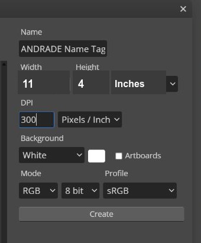{fig-alt="Photopea New Project dialog showing a document named ANDRADE Name Tag with width 11 inches, height 4 inches, 300 pixels per inch, and a white background."}

### Step 2 - Build a 0.25 inch safe margin

A **margin** is deliberate empty space between the artwork and the physical edge. It is not wasted space. It prevents the design from feeling crowded and gives room for small placement or material differences.

Enter **0.25 in** when Photopea accepts units. At 300 pixels per inch, the same margin is:

$$0.25\text{ in} \times 300\text{ px/in} = 75\text{ px}$$

Add guides at either measurement:

- **Vertical:** 0.25 in and 10.75 in, or 75 px and 3225 px
- **Horizontal:** 0.25 in and 3.75 in, or 75 px and 1125 px

Use **View > New Guide** for each guide. Keep every visible part of the logo and name inside the cyan guide box. The resulting safe area is **3150 × 1050 px**.

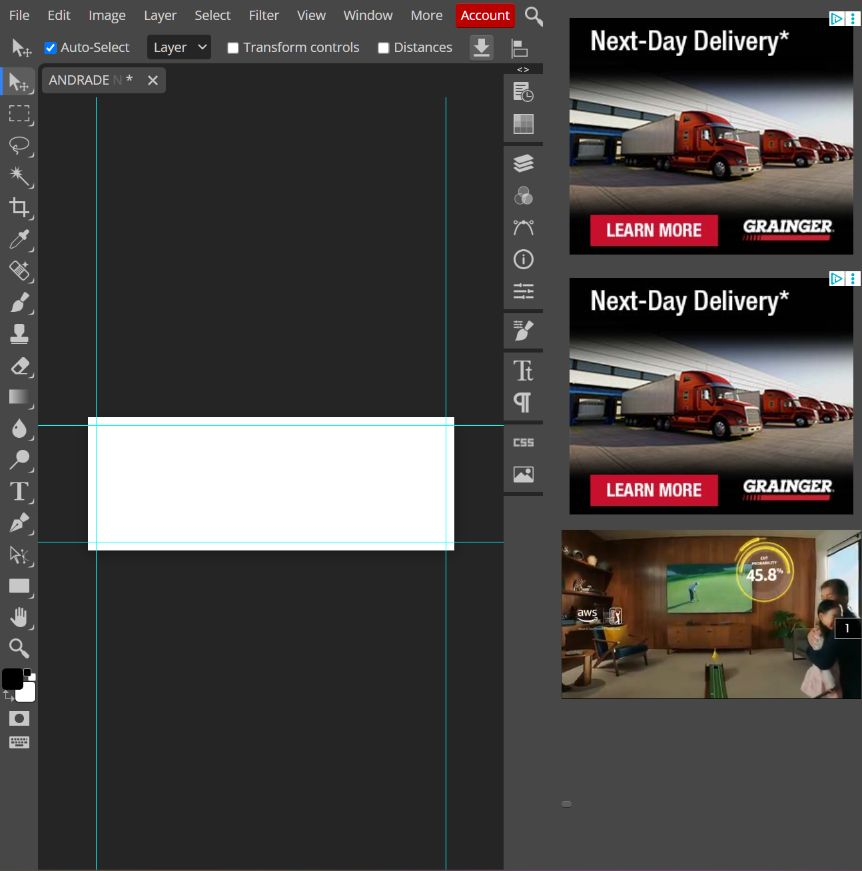{fig-alt="Photopea canvas with cyan vertical and horizontal guides defining a quarter-inch safe margin."}

### Step 3 - Place the transparent PNG logo

1. Choose **File > Open & Place**.
2. Select the transparent PNG logo.
3. Hold the aspect ratio lock so the logo does not stretch.
4. Resize from a corner. Do not pull only the width or height.
5. Move the logo inside the safe area.
6. Press **Enter** or click the checkmark to confirm.
7. Repeat if the design uses a second approved mark.

Andrew's example places the Technology Commons emblem first, followed by the AA lettermark. Each file remains on its own layer, which makes revision easier.

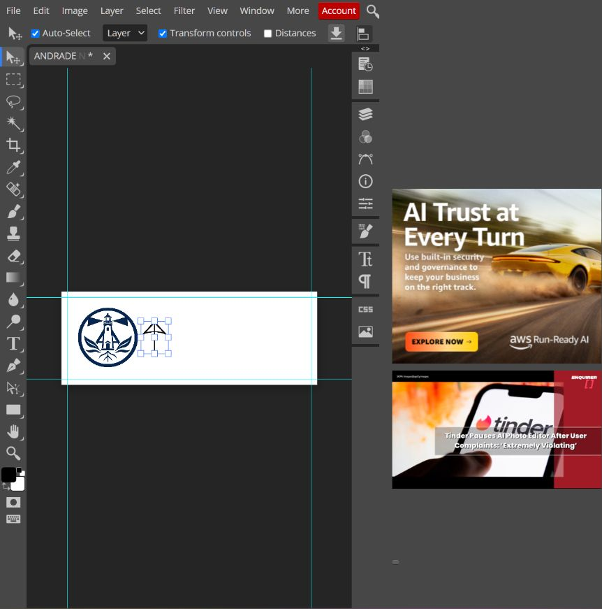{fig-alt="Photopea workspace showing the Technology Commons round emblem and AA lettermark placed near the left side of the 11 by 4 inch canvas."}

### Step 4 - Add a readable name

1. Select the **Type Tool (T)**.
2. Choose **Source Sans 3 Bold**. Source Sans Pro is also acceptable if that is the installed version.
3. Use black or another instructor-approved high-contrast colour.
4. Type the name in **ALL CAPS**.
5. Enlarge the name until it occupies about half the tag height while remaining inside the margin.
6. Keep the letters inside the safe margin and leave a clear gap after the logo.
7. Use the Move Tool to align the name visually with the logo, not just mathematically.

For Andrew's example, type **NDRADE** after the AA lettermark. The mark supplies the first A, so the complete visual reads **ANDRADE**.

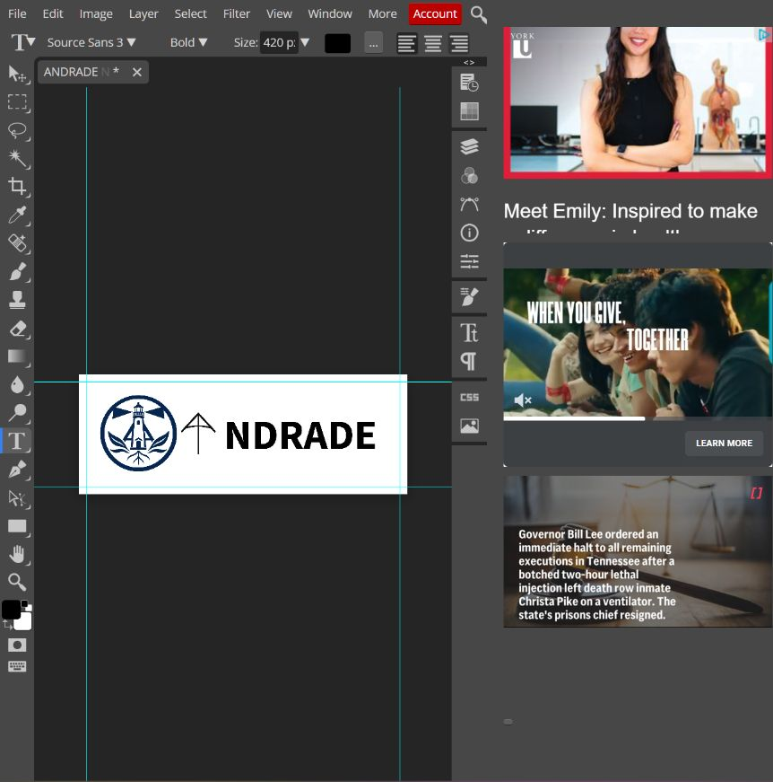{fig-alt="Photopea workspace showing the first draft with the Technology Commons emblem, AA lettermark, and NDRADE text at 420 pixels. The next step enlarges and strengthens this draft."}

### What makes a font readable?

Use a sans serif typeface with open letter shapes and enough stroke thickness to engrave clearly. **Source Sans 3 Bold** works well because the capitals are simple, the spacing is even, and similar letters remain easy to distinguish.

Prefer:

- Source Sans 3, Source Sans Pro, Arial, Helvetica, or another clean sans serif;
- Bold or Semibold for reliable engraving contrast;
- generous letter spacing and a size that can be read from about 2 metres away;
- one typeface and one clear hierarchy.

Avoid:

- thin, hairline, or distressed lettering;
- scripts where letters join or become ambiguous;
- highly condensed fonts that squeeze counters closed;
- stretching text wider or taller;
- placing letters against the edge.

**Readability test:** zoom out until the on-screen name tag is approximately hand-sized. Look away, then look back for two seconds. If the name is not immediately readable, simplify or enlarge it.

### Step 5 - Judge spacing and balance

Good spacing means the empty areas look intentional:

- **Outer margin:** all artwork stays at least 0.25 inch from every edge.
- **Logo-to-name gap:** the elements are related but do not collide. Aim for a gap similar to one medium-width letter.
- **One centreline:** the logo and name share the same horizontal visual centre.
- **Vertical centre:** select the complete group and centre it between the top and bottom edges.
- **Hierarchy:** the name is the first or equal reading target. Decorative details do not overpower it.
- **Breathing room:** no logo tip, letter, or accent crowds the guide.

The first draft below uses the Technology Commons emblem as the context mark, the AA lettermark as the first letter, and NDRADE as the readable word. It is intentionally kept as a **critique draft**: the letters are too small for the strongest distance reading, and the thin AA mark competes with the heavier type.

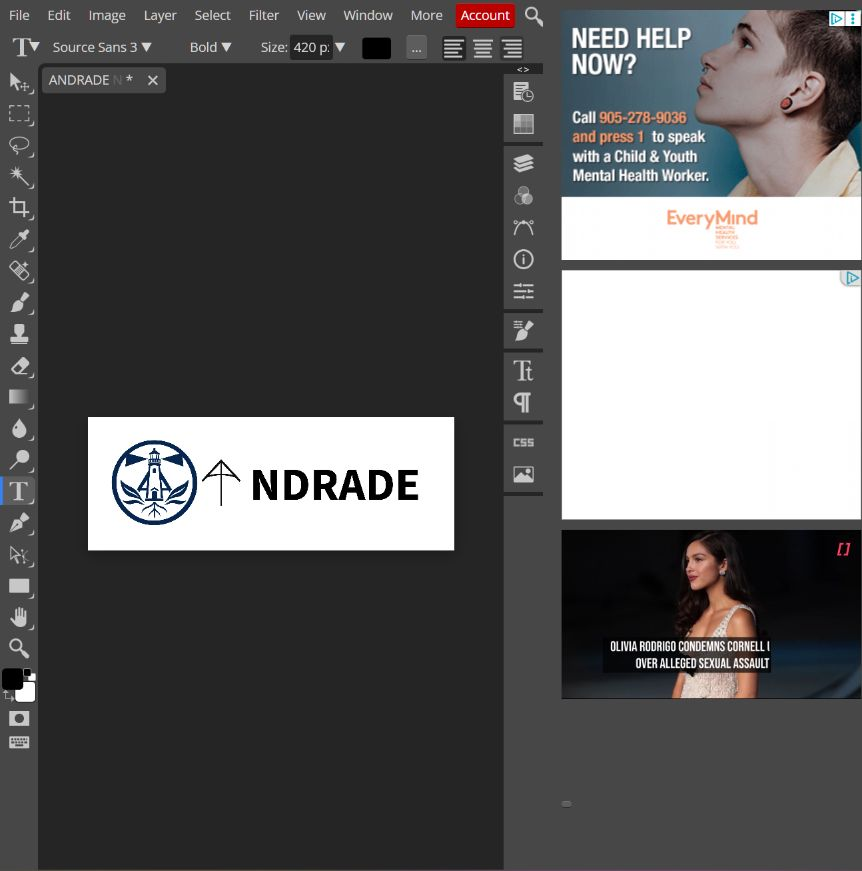{fig-alt="First Photopea draft with Technology Commons emblem, a thin AA lettermark, and NDRADE text. This draft is used for critique before making the name larger."}

### Make three variations before choosing

Do not stop at the first acceptable layout. Duplicate the document twice and change one major decision in each copy. Compare all three at the same display size and choose the version that communicates the name fastest.

#### Variation 1 - clear professional baseline

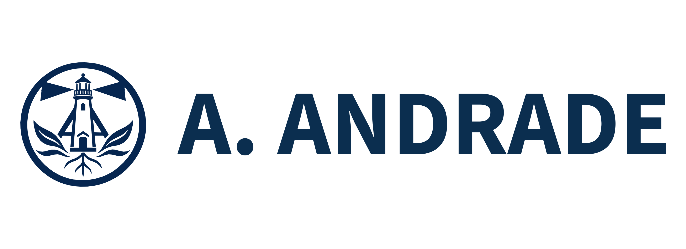{fig-alt="Eleven by four inch name tag with the Technology Commons emblem and large A. ANDRADE text in Source Sans 3 Semibold."}

This version uses the Commons emblem and **A. ANDRADE**. The logo and text share one centreline, and the complete group is centred vertically.

#### Variation 2 - maximum distance readability

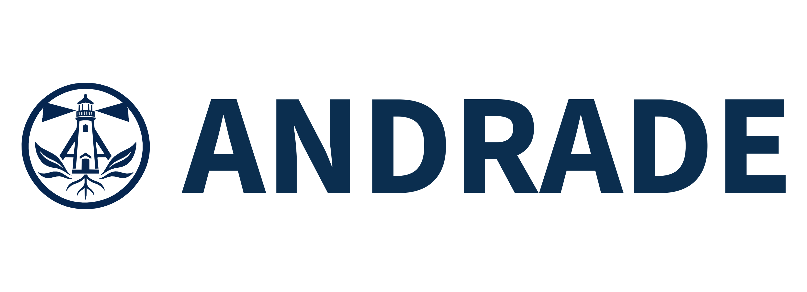{fig-alt="Eleven by four inch name tag with a smaller Technology Commons emblem and extra-large ANDRADE text."}

This version reduces the emblem and gives **ANDRADE** most of the available width. It is the strongest choice for reading across a room.

#### Variation 3 - personalized AA lettermark

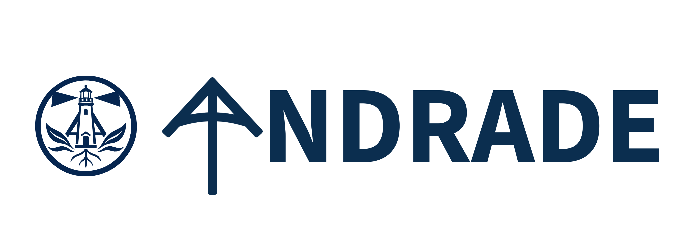{fig-alt="Eleven by four inch name tag with the Technology Commons emblem, a thickened AA lettermark, and large NDRADE text that reads together as ANDRADE."}

This version keeps the personal idea. The Commons emblem and **NDRADE** establish the main centreline. The AA mark uses an outside stroke so its weight matches the letters, then sits slightly lower because its broad top makes it look visually high when it is centred mathematically. The AA mark and NDRADE read as one word without overlapping.

::: {.callout-tip title="Recommended worked example"}
Use **Variation 3** for the detailed Photopea walkthrough because it teaches the most: transparent PNG placement, visual substitution, type matching, stroke weight, grouping, and distance testing. Keep Variations 1 and 2 as comparison examples.
:::

### Improve Variation 3 in Photopea

Starting from the first-draft screenshots above:

1. Select the **NDRADE** text layer and enlarge it until it occupies about half the tag height.
2. Select the AA layer. Choose **Layer > Layer Style > Stroke**.
3. Set the stroke position to **Outside**, use the same dark colour as the name, and begin near **0.06 in / 18 px**. Adjust only if a test engraving closes the interior spaces.
4. Keep the Technology Commons emblem near **1.6 inches high**.
5. Keep the AA mark near **1.9 inches high** and lock its aspect ratio.
6. Move NDRADE close enough that the mark reads as its first A. Do not leave a full-letter gap.
7. Align the emblem and name to one horizontal centreline. Then lower the top-heavy AA mark about **48 pixels (0.16 inch)** until the full word looks balanced.
8. Centre the complete group vertically and keep every element inside the **0.25 inch** safe margin.
9. Hide the guides and perform the two-second reading test from about **2 metres** away.

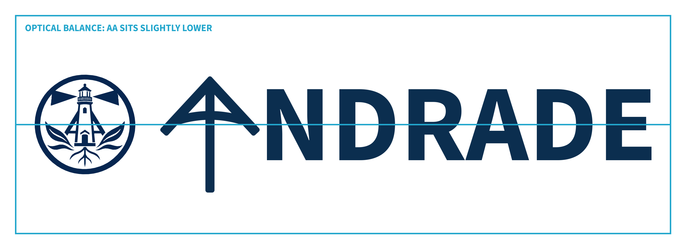{fig-alt="The Technology Commons emblem and NDRADE text share a horizontal centreline while the top-heavy AA lettermark sits slightly lower for optical balance, all inside a quarter-inch safe margin."}

The cyan line is a temporary guide through the emblem and name. The AA mark deliberately sits a little below it. This is **optical alignment**: judge what looks balanced, not only what measures as centred. Hide the guide before export.

### Student design files

Download the complete pack or inspect one direction at a time. Each Photoshop file is **11 × 4 inches at 300 ppi** and contains separately named artwork layers. The matching PNG is the clean full-size reference and export.

- [Download the complete name-tag design pack](../../assets/name-tag-photopea/downloads/name-tag-design-pack.zip)
- **Variation 1:** [Photoshop file](../../assets/name-tag-photopea/downloads/variation-1-commons-a-andrade.psd) | [PNG](../../assets/name-tag-photopea/downloads/variation-1-commons-a-andrade.png)
- **Variation 2:** [Photoshop file](../../assets/name-tag-photopea/downloads/variation-2-maximum-readability.psd) | [PNG](../../assets/name-tag-photopea/downloads/variation-2-maximum-readability.png)
- **Variation 3:** [Photoshop file](../../assets/name-tag-photopea/downloads/variation-3-thick-aa-ndrade.psd) | [PNG](../../assets/name-tag-photopea/downloads/variation-3-thick-aa-ndrade.png)
- **Source artwork:** [Technology Commons transparent PNG](../../assets/name-tag-photopea/downloads/source-files/technology-commons-transparent.png) | [original AA transparent PNG](../../assets/name-tag-photopea/downloads/source-files/aa-logo-original-transparent.png) | [thickened AA SVG](../../assets/name-tag-photopea/downloads/source-files/aa-logo-thickened.svg)

When students make their own version, they should replace the example name and logo rather than submitting an unchanged sample.

### Step 6 - Save the master and export the engraving PNG

1. Choose **File > Save as PSD** and save the editable master as `lastname-name-tag-master.psd`.
2. Hide guides with **View > Extras** or **Ctrl+H**.
3. Choose **File > Export As > PNG**.
4. Confirm the export size is still **3300 × 1200 px**.
5. Name it `lastname-name-tag-11x4-engrave.png`.
6. Click **Save**.
7. Reopen the exported PNG and check that nothing moved, cropped, or gained a white box.

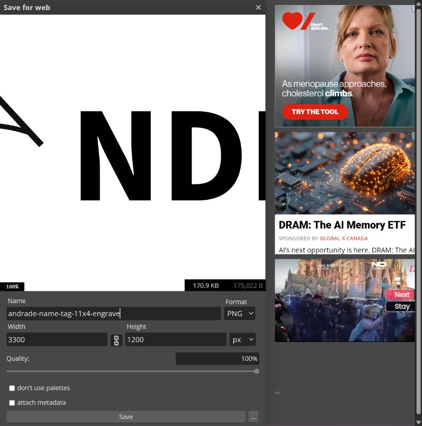{fig-alt="Photopea Save for Web dialog with PNG selected, width 3300 pixels, height 1200 pixels, and a clear engraving filename."}

Photopea's [Open and Save guide](https://www.photopea.com/learn/opening-saving) explains the difference between saving an editable PSD and exporting a delivery format.

## Student submission checklist

Check every statement before handing in the file:

- [ ] My canvas is 11 × 4 inches at 300 pixels per inch.
- [ ] My logo is an approved PNG with a transparent background.
- [ ] I did not stretch the logo.
- [ ] All artwork remains inside the 0.25 inch safe margin.
- [ ] The logo and name share one horizontal centreline.
- [ ] The complete group is centred vertically.
- [ ] My name is in a readable sans serif font.
- [ ] My name can be read quickly from about 2 metres away.
- [ ] The logo-to-name gap and outer margins look intentional.
- [ ] Guides are hidden in the export.
- [ ] I saved the editable PSD and the final PNG separately.
- [ ] I reopened the PNG and checked crop, orientation, contrast, and spelling.
- [ ] My submitted machine job is labelled **ENGRAVE ONLY**.

## Short reflection

1. Why was PNG a better choice than JPG for your logo?

   ________________________________________________________________________________

2. What did you change to make your name easier to read?

   ________________________________________________________________________________

3. Where is the smallest gap in your layout, and is it still larger than the safe margin?

   ________________________________________________________________________________

4. If you revised the tag, what would you change first?

   ________________________________________________________________________________

## Before pressing start

Follow the local material approval, focus, ventilation, supervision, fire-watch, and shutdown procedure. Confirm that the wood blank is approved and that the machine job is **engrave only**. No cyan guide, page border, or accidental vector cut boundary should appear in the submitted PNG.

::: {.ter-curriculum-relevance}
**Ontario curriculum relevance:** useful for **TIJ1O** and **TDJ2O** learning involving raster and vector graphics, visual communication, exact dimensions, file preparation, manufacturing processes, safe tool use, and evaluation of a produced artifact.
:::

Continue with the [planning worksheet and classroom toolkit](resources/index.qmd), or move to the optional [Make It Stand](02-make-it-stand.qmd) structural extension.

## References

- [Photopea: Open and Save](https://www.photopea.com/learn/opening-saving)
- [MDN: Image file type and format guide](https://developer.mozilla.org/en-US/docs/Web/Media/Guides/Formats/Image_types)
- [Google Fonts: Source Sans 3](https://fonts.google.com/specimen/Source+Sans+3)
