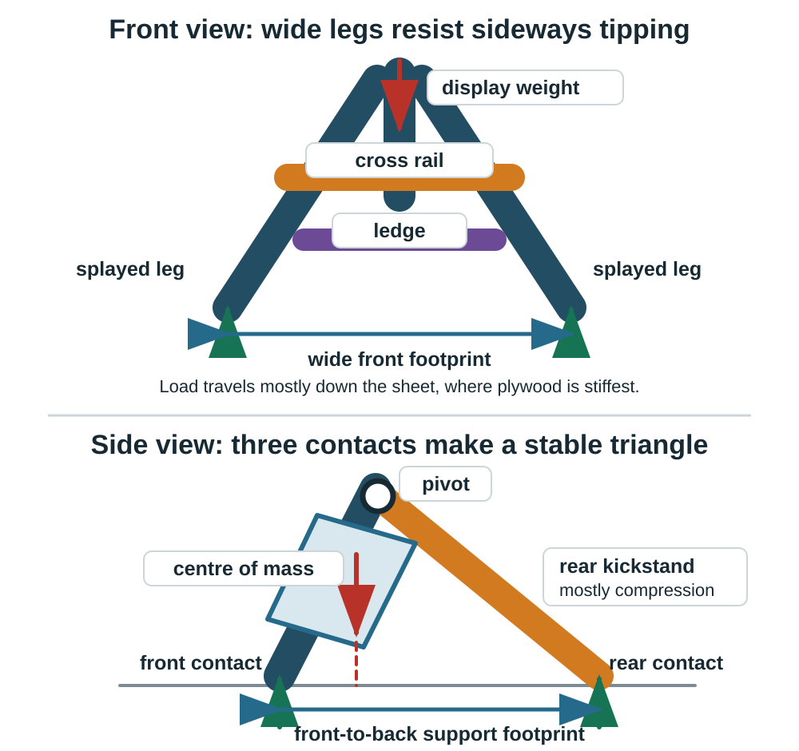

::: {.ter-project-brief}
## Optional extension

After completing the core engraving project, choose whether to make the plaque stand independently using **feet, legs, a slot base, an easel or another support**. This is not required for the first TAS name tag.

[Open the Laser-Cut Leg & Support Builder](../tools/leg-builder/index.qmd){.btn .btn-primary}
:::

## Investigate alternatives

Do not give every student one finished stand file. Compare triangular legs, straight or angled legs, curved legs, T-feet, cross-feet, slot bases, easel backs, and two-leg systems. Ask what each solution changes about the footprint, material use, assembly, viewing angle, and centre of gravity.

The [project-components library](../../teaching-materials/laser-cutting/?type=project-components#library) provides starting geometry for investigation. Students remain responsible for adapting dimensions, selecting a concept, testing it, and documenting why it works.

Use the focused [standing-name-tag component set](../../assets/laser-library/classroom-kit/standing-name-tag/standing-name-tag-components.svg) to compare a triangle leg, T-foot, cross-foot and easel back. Copy a concept into a new file; do not submit the palette sheet as the project. Complete the [fabrication planning worksheet](resources/fabrication-planning-worksheet.qmd) and follow [Paper to Inkscape](resources/paper-to-inkscape.qmd).

## Easel reference set

The external [FreePatternsArea easel set](https://www.freepatternsarea.com/designs/free-laser-cut-easel-templates-svg-dxf-cdr/) shows four variations on the same structural idea. Each uses a wide A-shaped front frame, one or more crosspieces, and a rear leg or kickstand. The variations change the ledge, hinge pieces, rear-leg adjustment and decorative openings rather than changing the basic load path.

The source describes a **5.51 in high, 3.70 in wide easel for 0.118 in material** (140 × 94 mm, using 3 mm stock). It suggests scaling the complete design by $4/3 = 1.333$ for 0.157 in (4 mm) material, which produces an easel about **7.35 in high and 4.92 in wide** (187 × 125 mm). That preserves every proportion, including the slots. It is not the best method when you want to change the display height without changing the material thickness. In that case, resize the structure and reset every slot from the measured material instead.

::: {.callout-warning}
## Reference, not a verified cutting file

The SVG declares a numerical viewBox but does not declare a physical unit. Import it using a known reference dimension, confirm the intended 5.51 in (140 mm) assembled height, and measure every slot before cutting. The files have not been physically verified by Technology Commons.

The source currently identifies the design as **CC BY-NC-SA 4.0 for personal, non-commercial use**. Preserve the FreePatternsArea credit and check the [current licence terms](https://www.freepatternsarea.com/license-agreement/) before using or sharing the files. These external files are not covered by the Technology Commons CC BY-SA licence.
:::

Reference formats: [SVG](../../assets/laser-library/references/freepatternsarea-easel-templates/free-laser-cut-easel-templates.svg), [DXF](../../assets/laser-library/references/freepatternsarea-easel-templates/free-laser-cut-easel-templates.dxf), [DWG](../../assets/laser-library/references/freepatternsarea-easel-templates/free-laser-cut-easel-templates.dwg), [CDR](../../assets/laser-library/references/freepatternsarea-easel-templates/free-laser-cut-easel-templates.cdr), [PDF](../../assets/laser-library/references/freepatternsarea-easel-templates/free-laser-cut-easel-templates.pdf), and [PNG preview](../../assets/laser-library/references/freepatternsarea-easel-templates/free-laser-cut-easel-templates.png).

### How to read the flat reference files

The six downloads above are alternate formats of the same reference sheet. For the Technology Commons workflow, open the **SVG in Inkscape**. Use the PDF or PNG only to look at or print the design. DXF and DWG are for CAD/CAM software, and CDR is for CorelDRAW.

The outlines are flat parts, not a picture of the assembled easel. In the cropped example, the large A-shaped outline is the front frame and the large T-shaped outline is the **wide single rear support**. That T-shaped part is the large single leg: its wide top provides an attachment or hinge zone and its broad centre reaches the table. It does not stand by itself. The complete design still needs the front frame, an attachment between the parts, and a stop or tether that controls the opening angle.

The source sheet does not label every part or provide a verified step-by-step assembly sequence. Keep each apparent group together, prototype it in cardboard, and do not guess the purpose of an isolated small outline. For a clearer original starting point, choose **Wide single easel back · like the reference** in the [Leg & Support Builder](../tools/leg-builder/index.qmd); the tool now shows both the flat cut part and a coloured assembled view.

## What the legs actually do

{fig-alt="The front view shows two splayed front legs, a cross rail, ledge, downward display weight and upward ground reactions. The side view shows the front frame, rear kickstand, pivot, centre of mass and the front-to-back support footprint."}

### Two splayed front legs

The two front legs carry most of the vertical load. Their feet are farther apart than their tops, so the front support width is large without making the top bulky. The load should travel mostly **along the plane of the sheet and down the legs as compression**. Sheet material is much stiffer in its own plane than it is when pushed sideways out of plane.

The space between the legs is not only decorative. Removing low-demand material reduces mass while leaving a deep outer frame. The remaining rail width must still resist cracking at slots, grain defects and narrow corners.

### Rear kickstand

The rear leg changes the frame from a nearly flat object into a triangle. In side view, the front feet and rear foot form a support footprint. The stand remains stable while the vertical projection of the combined centre of mass stays inside that footprint.

Moving the rear foot farther back increases the tipping margin and usually reduces the force needed to balance the display. It also creates a longer, more slender leg. A loose pivot or a sideways bump can then make the leg bend or buckle. The rear leg works best when its top pivot and bottom contact keep the main force close to the leg's centreline, so the part carries compression instead of acting like a long cantilever.

### Cross rail and ledge

The cross rail ties the two front legs together. It resists **racking**, where the frame changes from a symmetric A shape into a skewed shape, and **splaying**, where the feet move apart. The ledge carries the displayed object and transfers that load into both front legs. A ledge attached at only one small tab creates a concentrated bending force; two separated tabs or a continuous shoulder distribute the load more effectively.

### Pivot, tabs and slots

The pivot carries shear between the front frame and rear leg while allowing the angle to change. A larger hole removes more of the leg's net section, and a hole close to an edge can split the remaining material. Keep useful material around the hole, use a washer or smooth spacer where appropriate, and test repeated opening and closing.

Tabs and slots locate parts and transfer shear through bearing on their faces. The **shoulder**, not the fragile tip of a tab, should stop the part at its final position. Make the slot from measured thickness plus a tested fit adjustment; do not assume nominal plywood thickness is exact.

## Bending force and size

The basic bending moment is:

$$M = F L$$

where $F$ is the applied force and $L$ is the perpendicular distance to the section being checked. Doubling the display load or doubling the lever arm doubles the bending moment.

For a long member behaving roughly like a cantilever, deflection changes approximately with:

$$\delta \propto \frac{F L^3}{E I}$$

This explains why a leg that is merely twice as long can feel about eight times more flexible when its cross-section is unchanged. $E$ describes the material stiffness and $I$ describes how the material is distributed around the bending axis.

For a rectangular strip bending out of the sheet plane, $I$ includes the material thickness cubed. Increasing thickness from 0.118 in to 0.157 in (3 to 4 mm) can therefore increase weak-axis bending stiffness by roughly $(4/3)^3 = 2.37$ when the other dimension stays the same. Increasing thickness from 0.118 in to 0.236 in (3 to 6 mm) gives roughly $2^3 = 8$ times the weak-axis stiffness. Real plywood varies by species, ply quality, grain direction, voids, moisture and cut quality, so these ratios explain trends rather than certify a load.

The most effective design move is not simply making every leg thick. Keep forces in plane, use a triangular footprint, shorten unsupported lengths, tie the front legs together, and avoid eccentric joints that twist the sheet.

## Starting proportions to investigate

These are prototype starting points for a light display easel, not structural ratings:

| Feature | Starting relationship | Why it matters |
|---|---:|---|
| Front footprint width | about 0.6 to 0.75 of easel height | improves side-to-side tipping resistance |
| Rear-foot distance | about 0.35 to 0.5 of easel height | improves front-to-back tipping resistance |
| Front leg or frame-rail width | at least 4 to 6 material thicknesses | leaves a useful net section around cutouts and slots |
| Cross-rail depth | at least 4 material thicknesses | helps resist racking and leg splay |
| Tab length along an edge | at least 4 material thicknesses | distributes bearing instead of concentrating it at one small tab |
| Material beside a slot | at least 2 material thicknesses as a first check | reduces splitting at the slot end |

For 0.118 in (3 mm) stock, those starting relationships suggest front rails around 0.47 to 0.71 in wide, a cross rail at least about 0.47 in deep, and a tab at least about 0.47 in long. These are hypotheses to test with the actual stock, not guaranteed minimums.

## Worked example: 11 × 4 inch name plate

Assume the plaque is **11 inches wide, 4 inches high and nominally 1/8 inch thick**. Measure the actual material rather than entering exactly 0.125 inch automatically. Define the viewing angle from the tabletop: 75 degrees is 15 degrees back from vertical, while 80 degrees is 10 degrees back from vertical.

| Viewing angle | Top moves behind the bottom | Vertical rise | Centre-of-mass projection behind the bottom |
|---:|---:|---:|---:|
| 75° | 1.04 in | 3.86 in | 0.52 in |
| 80° | 0.69 in | 3.94 in | 0.35 in |

The centre-of-mass values assume a uniform plaque without a heavy attachment. The support footprint must extend behind that projected point, with additional margin for bumps and material variation.

### Stronger, quieter option: two high supports

- Put two triangular cheeks or rear legs about **1.5 to 2 inches in from each end** of the 11-inch plaque.
- Attach each support about **3 to 3.5 inches above the bottom edge**.
- Start with the rear contact about **1.5 to 1.75 inches behind the plaque's bottom contact**.
- A rear member from a 3.25-inch-high attachment to that footprint is about **3.2 to 3.4 inches long** at the proposed angles.

The pair distributes load across the plaque and resists twisting. The higher attachment gives the support more leverage to resist rotation, but the longer member needs enough width to prevent sideways bending. A triangular cheek is usually stiffer than a narrow stick because it shortens the unsupported load path.

### Sleeker option: one low centre support

A single centred support can attach about **1.25 inches above the bottom**, place its rear contact about **1.25 inches behind the bottom**, and use a member about **1.5 to 1.6 inches long**. This is compact and visually quiet, but the smaller vertical spacing creates greater force at the joint for the same overturning moment. One central support also provides less resistance to twisting across an 11-inch-wide plaque.

Use two separated bottom locating points or a continuous ledge even if there is only one rear leg. They stop the plaque from rotating around the centre support. Widening the concealed base of the centre support also improves side-to-side stability without making the visible leg taller.

### Prototype sequence

1. Draw both side profiles full size on half a sheet of paper or cardboard.
2. Test 75 degrees and 80 degrees. Choose the smallest tilt that still reads well under the expected viewing height.
3. Test the two-support version first as the reference design.
4. Remove material or move toward a single centre support only after the reference design passes the push tests.
5. Measure the real 1/8-inch stock and cut a slot coupon. Set the slot from measured thickness plus the tested fit adjustment.
6. Push at both ends and at the top centre. Watch for tipping, plaque twist, slot splitting and out-of-plane leg bending.

## Stability checks

- Locate the combined centre of mass approximately over the support area.
- Increase the support footprint where tipping is likely.
- Consider plaque height, thickness, angle, and the direction of expected bumps.
- Test front-to-back and side-to-side stability.
- Push lightly from both sides and watch for out-of-plane leg bending or pivot twist.
- Check whether the cross rail prevents the front legs from spreading.
- Check whether slots weaken a narrow region or create fragile grain directions.
- Inspect the net material around every pivot hole and slot end.
- Record what changed between versions.
- Label the load path and the interface that locates the engraved blank.
- Test the stand with the actual blank rather than a guessed rectangle.

Use cardboard or scrap material for a quick geometry prototype before cutting the full design. A stand that works only on a perfectly still surface needs another iteration.

::: {.ter-curriculum-relevance}
**Ontario curriculum relevance:** Supports **TIJ1O** and **TDJ2O** design-process learning through alternatives, modelling, stability, constraints, testing, feedback, and iteration. Construction and manufacturing contexts may connect to **TCJ2O** and **TMJ2O**.
:::

Continue as needed with [Measure + Place](03-measure-place.qmd), or return to the [laser project choices](index.qmd).
