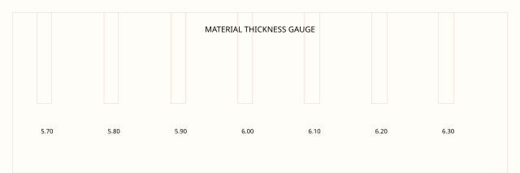
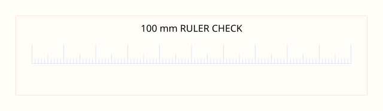
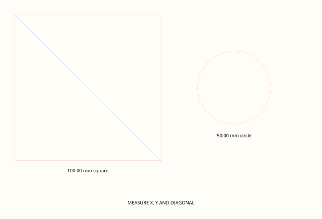
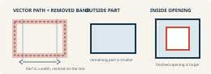
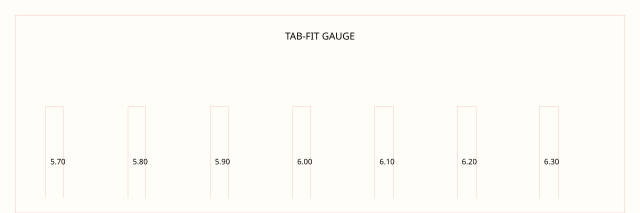
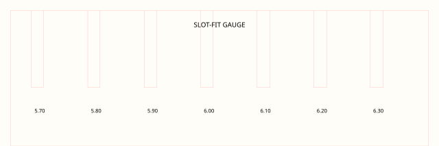
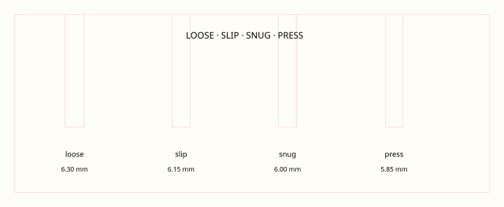
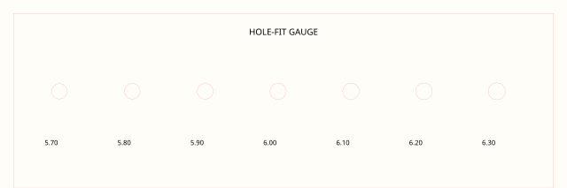

Calibration is not one magic kerf value. It is a short, recorded test that connects **this sheet**, **this machine condition**, **this geometry**, and **this intended fit**.

1 · Confirm course process2 · Measure stock3 · Verify scale4 · Make a test5 · Measure result6 · Choose + record fit

## Operating procedure or material calibration?

<section><h3>Operating procedure</h3>
Machine-specific setup, safety instruction, assessments, and authorization are not provided on this public website. Follow your school board's safety guidelines and the course-specific instruction provided by your teacher. Students in Mr. Andrade's classes can find that information in Google Classroom.
</section>
<section><h3>Material calibration</h3>
Measure how one stock-and-setting combination changes size and fit. This is about the result of the process.
<ul><li>Actual thickness and batch are recorded.</li><li>A known drawing dimension imports at 100%.</li><li>Cut width and finished dimensions are measured.</li><li>Slots and holes are tested against the real mating object.</li></ul></section>

## 1 · Measure the actual sheet

Plywood sold as 1/4 inch may not measure 6.35 mm. Measure at several locations with callipers, including near a visibly damaged edge but not on it. Record the minimum, maximum and the value used to design the test.

<a class="ter-calibration-card" href="../../assets/laser-library/previews/calibration/tc-cal-material-thickness.svg"><strong>Material thickness</strong>Record a measured range, not a catalogue assumption.</a>
<a class="ter-calibration-card" href="../../assets/laser-library/previews/calibration/tc-cal-ruler-check.svg"><strong>Ruler / scale check</strong>Confirm millimetres and 100% import before cutting.</a>
<a class="ter-calibration-card" href="../../assets/laser-library/previews/calibration/tc-cal-dimension-verification.svg"><strong>Dimension verification</strong>Compare a known drawing dimension to the finished result.</a>

## 2 · Understand what kerf changes

The beam removes a narrow band centred on the path. With the path drawn on the intended boundary, an outside part tends to finish smaller and an inside opening tends to finish larger. The magnitude varies, so do not copy a universal number.

{.ter-kerf-diagram}

BRM’s current [kerf and kerf-compensation explanation](https://support.brmlasers.com/en/materials-and-parameters/materials/kerf-and-kerf-compensation) is a useful process reference. BRM also hosts a [free kerf gauge SVG](https://support.brmlasers.com/en/downloads/cut-files/laser-files), credited there to Nameek and Elplatt, and explicitly tells users to check scale after import. Use it as another test method, not as a pre-approved local setting.

Ponoko’s 2011 article, [Figuring out kerf for precision parts](https://www.ponoko.com/blog/ponoko/figuring-out-kerf-for-precision-parts/), is included only as a **historical/conceptual** example of test-and-revise thinking. Do not copy its old settings or service-specific assumptions.

<a class="ter-calibration-card" href="../../assets/laser-library/previews/calibration/tc-cal-kerf-test.svg"><strong>Kerf test</strong>Measure a repeated cut rather than guessing from one edge.</a>
<a class="ter-calibration-card" href="../../assets/laser-library/previews/calibration/tc-cal-tab-fit.svg"><strong>Tab fit</strong>Test the male feature and its orientation.</a>
<a class="ter-calibration-card" href="../../assets/laser-library/previews/calibration/tc-cal-slot-fit.svg"><strong>Slot fit</strong>Start from measured thickness, then compare a small series.</a>
<a class="ter-calibration-card" href="../../assets/laser-library/previews/calibration/tc-cal-four-fit-series.svg"><strong>Four-fit series</strong>Name the function: loose, sliding, snug or press.</a>
<a class="ter-calibration-card" href="../../assets/laser-library/previews/calibration/tc-cal-hole-fit.svg"><strong>Hole fit</strong>Test the actual bottle, dowel or fastener, not only a calliper.</a>

## 3 · Cut, measure and decide

1. Open one test SVG in Inkscape and confirm document units, `viewBox` scale and a known dimension.
2. Label the coupon with material, batch, date, machine and revision before cutting.
3. Use the course-specific process provided by your teacher.
4. Let the coupon cool and measure it consistently; do not force a calliper into a soft or angled edge.
5. Test the real mating object in every candidate feature.
6. Select the fit that serves the function. A press fit is not automatically “more accurate” than a sliding fit.
7. Update the source dimension, save the record and repeat only the smallest necessary test.

::: {.callout-warning}
Kerf compensation changes geometry; it does not correct a machine-condition problem, warped stock, or an incorrectly scaled import. Resolve unexpected machine behaviour through the course-specific process before interpreting the coupon.
:::

## Printable calibration record

<section class="ter-calibration-record">
<h3>Technology Commons · Laser calibration record</h3>

Name / group 

Date 

Machine 

File + revision 

Material / batch 

Nominal thickness 

Measured min / max 

Drawing scale checked with 

Course process reference 

Calibration revision 

<table><thead><tr><th>Feature / nominal</th><th>Measured result</th><th>Real-object fit</th><th>Decision / next revision</th></tr></thead><tbody><tr><td>&nbsp;</td><td></td><td></td><td></td></tr><tr><td>&nbsp;</td><td></td><td></td><td></td></tr><tr><td>&nbsp;</td><td></td><td></td><td></td></tr><tr><td>&nbsp;</td><td></td><td></td><td></td></tr></tbody></table>

Selected fit and why 

Observed issues / follow-up 

Tester / instructor review 

</section>

[Open the complete calibration library](../../teaching-materials/laser-cutting/?type=calibration#library) for downloadable source files.

::: {.ter-curriculum-relevance}
**Ontario curriculum relevance:** Strongly relevant to **TMJ2O Manufacturing Technology**, **TDJ2O**, and **TIJ1O**, with applications in **TCJ2O**, **TEJ2O**, and senior manufacturing/design courses involving measurement, tolerance, process control, quality, jigs, fixtures, and CAD/CAM.
:::

Next: apply the recorded dimensions in [Assemblies + Hybrid Fabrication](05-assemblies-hybrid-fabrication.qmd), the [Fabrication Plate Builder](../tools/plate-builder/index.qmd), or your own Inkscape source.
