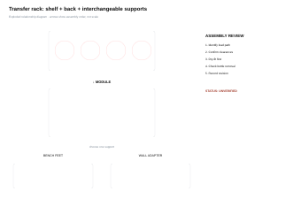

These canonical notes support a simple first TAS project and a deeper reusable fabrication pathway. Students can learn engraving versus cutting, SVG preparation, scale, material measurement, kerf, fit, holes, slots/tabs, supports, assemblies, hybrid fabrication and testing without treating every lesson as a required project.

The learning sequence lives here. The separate [Laser Fabrication Library](../../teaching-materials/laser-cutting/index.qmd) holds downloadable SVGs, calibration files, editable geometry, project components, holders, and inspiration.

For the active name-tag project, use the [classroom toolkit](resources/index.qmd). For advanced work, the toolkit also includes component palettes, standing-name-tag ideas, five pill-bottle organizer references and teaching slides. For repeated holes and measured plates, open the [Fabrication Plate Builder](../tools/plate-builder/index.qmd), then verify the result with the [material-fit calibration workflow](04-material-fit-calibration.qmd).

For a freestanding holder, use the [Laser-Cut Leg & Support Builder](../tools/leg-builder/index.qmd) to generate measured legs, matching slots and a fit coupon, then read [Make It Stand](02-make-it-stand.qmd) to check the load path and stability.

Advanced extension · not a required TAS project
<h2>Organizer assemblies and reusable fabrication tools</h2>
Compare five pill-bottle strategies, inspect exploded views and true-size parts sheets, then study real build/revision evidence in the Tool Organizer Gallery.

<a class="btn btn-primary" href="../tools/tool-organizer-gallery/index.qmd">Open the Tool Organizer Gallery</a> <a class="btn btn-outline-secondary" href="resources/pill-bottle-organizer.qmd">View reference assemblies</a>

## Current TAS project

::: {.ter-project-brief}
### Name + Logo Wood Name Tag

First, students complete the [Personal Logo: Initials to SVG worksheet](../02-digital-design/03-logos-lettermarks.qmd). Then they prototype the full 11 × 4 inch layout on paper, build the aligned logo-and-name lockup in Photopea, export a PNG, engrave it, and evaluate spacing and legibility.

[Open the name-tag project →](01-name-logo.qmd)
:::

## Learn as the project requires

<ol class="ter-lesson-sequence">
  <li><a href="03-measure-place.qmd">Measure + Place</a>: use calipers, exact geometry, spacing, arrays, and margins.</li>
  <li><a href="04-material-fit-calibration.qmd">Material Fit + Calibration</a>: measure actual stock, test kerf and choose a fit.</li>
  <li><a href="05-assemblies-hybrid-fabrication.qmd">Assemblies + Hybrid Fabrication</a>: combine precision faces with structural backers and conventional hardware.</li>
</ol>

## Optional and general projects

<article class="ter-project-card">
Optional extension
<h3>Make It Stand</h3>
Add feet, legs, a slot base, easel or another support to investigate stability and fit.

<a href="02-make-it-stand.qmd">Open the extension →</a>
</article>
<article class="ter-project-card">
Compact seasonal project
<h3>Holiday Ornament / Reindeer</h3>
Design or legally adapt an ornament; a reindeer is one possible worked idea, not the class answer.

<a href="holiday-ornament-reindeer.qmd">Open the ornament project →</a>
</article>
<article class="ter-project-card">
General / advanced
<h3>Tool Organizer</h3>
Study strong precedents, measure real tools, improve at least three qualities, test access and fit, then document DESIGN → BUILD → FEEDBACK → REVISION.

<a href="06-tool-holder.qmd">Open the project guidance →</a> · <a href="resources/reverse-engineer-improve.qmd">Use the reverse-engineering challenge →</a>
</article>
<article class="ter-project-card">
General / advanced
<h3>Wall + Bench and Capstone</h3>
Explore removable mounting, serviceability, hybrid fabrication or an independent N.I.C.E. design problem.

<a href="07-wall-bench-module.qmd">Wall + bench module →</a> · <a href="08-capstone.qmd">Capstone →</a>
</article>

## School board and course safety information

This public website explains design and fabrication concepts. Machine-specific safety instruction, operating procedures, assessments, and authorization are kept outside the website. Follow your school board's safety guidelines and the course-specific instruction provided by your teacher. Students in Mr. Andrade's classes can find that information in Google Classroom. This page is not permission or authorization to operate equipment.

::: {.ter-curriculum-relevance}
**Ontario curriculum relevance:** Strongly relevant to **TIJ1O Exploring Technologies**, **TDJ2O Technological Design**, and **TMJ2O Manufacturing Technology**. Measurement, joinery, fixtures, and material use can support **TCJ2O**; enclosure and electronics contexts can support **TEJ2O**; and tool-organization or service contexts can support selected **TTJ2O** applications.

Senior applications may fit **TDJ3M/TDJ4M**, **TDJ3O/TDJ4O**, and relevant **TMJ3M/TMJ4M**, **TMJ3C/TMJ4C**, or **TMJ3E/TMJ4E** projects when the actual lesson addresses CAD/CAM, manufacturing processes, precision, fixtures, or assemblies.
:::

Start with the [Name + Logo Wood Name Tag](01-name-logo.qmd), or [browse the complete Fabrication Library & Tools collection](../../teaching-materials/laser-cutting/index.qmd).
