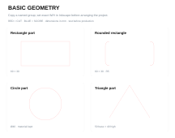
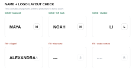
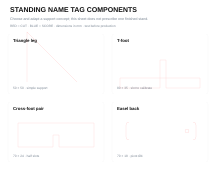
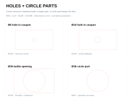
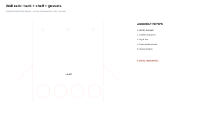

Project this page one card at a time or print it as a compact teacher sequence. Each card answers: what are we making, why, what is new, what is the first task, what does good look like, and are we ready to fabricate?

## The workflow

{fig-alt="Basic geometry component palette" width="68%"}

**Paper plan → measure → exact parts → layout → fabricate → test → revise**

## Before every cut

:::: {.columns}
::: {.column width="50%"}
### File

- mm + correct page size
- one outline per cut
- named parts
- CUT / SCORE / ENGRAVE checked
:::
::: {.column width="50%"}
### Shop

- approved material
- focus + ventilation
- machine preview
- supervision + fire watch
:::
::::

# Project 1

## Name + logo engraving

Today we make **one readable identity design** for a teacher-supplied, pre-cut wood blank.

New skill: fitting raster artwork to a measured physical object.

## First task

1. Measure the blank: width × height.
2. Open the [editable template](../../../assets/laser-library/classroom-kit/name-tag/name-tag-engraving-template.svg).
3. Set the page to the measured size.
4. Add name + original logo.
5. Export the page as PNG.

## Three layouts worth testing

{fig-alt="Examples of balanced, left-mark and stacked layouts plus common layout problems" width="86%"}

## Ready to engrave?

- Name reads at arm's length.
- Logo and name have clear hierarchy.
- Artwork stays inside the agreed margin.
- No guide rectangle appears in the PNG.
- PNG crop, orientation and contrast were checked.

# Project 2

## Make the name tag stand

Today we turn a flat graphic into a stable object.

New skill: choosing support geometry from a load and footprint.

## First task

Draw front, top and side views. Mark:

- plaque size and thickness;
- support footprint;
- slot or fastener;
- likely tipping direction;
- one dimension that needs a test.

## Compare, then choose

{fig-alt="Four standing name tag support concepts" width="76%"}

## A good stand

- stays upright after a light desk bump;
- keeps centre of mass over its support area;
- does not hide the engraving;
- assembles without forcing parts;
- records what changed after the cardboard or scrap test.

# Project 3

## Measure + organize

Today we create repeated openings from a real object, not from a guess.

New skill: controlling diameter, clearance, spacing and edge margin.

## HOLE or CIRCLE PART?

{fig-alt="Hole palette comparing holes inside larger parts and retained circle parts" width="78%"}

Same path shape. Opposite manufacturing intent. **Name it.**

## First task

Measure three examples of the object. Record:

1. widest controlling dimension;
2. range of measurements;
3. removal clearance;
4. centre-to-centre spacing;
5. remaining material at the edge and between openings.

## Ready for the complete layout?

- One opening coupon fits.
- A hand can remove the object.
- Neighbours do not collide.
- Duplicates came from one checked original.
- Labels match actual positions.

# Project 4

## Auto-shop pill-bottle organizer

Today we compare four assembly systems for the same storage need.

New skill: parts, interfaces, BOM, load path and assembly order.

## Four reference systems

1. Simple shelf rack
2. Dowel-supported rack
3. Reinforced wall rack
4. Removable wall / bench rack

Use a reference to study relationships. **Your measured bottle controls the file.**

## Example parameters

:::: {.columns}
::: {.column width="50%"}
- body Ø = 34 mm
- cap Ø = 42 mm
- radial clearance = 1 mm
- opening Ø = 36 mm
:::
::: {.column width="50%"}
`opening = body + 2 × clearance`

Cut one opening before four.
:::
::::

## Assembly review

{fig-alt="Exploded relationship diagram for a reinforced wall rack" width="72%"}

What carries the load? What locates the parts? What can fail first?

## Ready to fabricate?

- measured bottle parameters replaced defaults;
- BOM matches visible parts;
- assembly order is possible;
- fit coupon passed;
- free-standing stability or wall plan is approved;
- file still says **unverified** until the physical record exists.

# Transfer

## Your next organizer

Choose a real tool family. Repeat the same logic:

**observe workflow → measure → plan views → use components → test critical feature → assemble → user test → revise**

## Evidence, not decoration

Hand in:

- paper planning sheet;
- editable SVG master;
- fabrication/export file;
- BOM or part list;
- fit/stability evidence;
- one clear revision statement.
