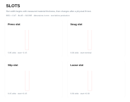
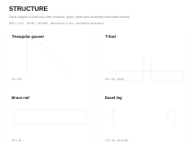
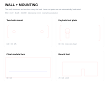
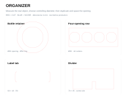

This toolkit supports one connected sequence: **name + logo engraving → make it stand → measure + organize → pill-bottle organizer → independent tool holder**. The repeated routine is the point:

<ol class="ter-design-cycle"><li>paper plan</li><li>measure</li><li>build with exact parts</li><li>fabricate + test</li><li>revise</li></ol>

Five visible reference systems
<h2>Organizer assembly gallery</h2>
See the complete assemblies and true-size cutting sheets side by side. Each design has its own parts download, exploded view, build concept and test question.

<a class="btn btn-primary" href="pill-bottle-organizer.qmd">See all five assemblies + files</a>

## Start here

::: {.ter-project-grid}
::: {.ter-project-card}
### Plan before opening Inkscape

Use the [reusable fabrication planning worksheet](fabrication-planning-worksheet.qmd) for a problem statement, front/top/side sketches, critical dimensions, part list, operations, assembly sequence, safety and test evidence.
:::
::: {.ter-project-card}
### Move the plan into the file

Follow [Paper to Inkscape](paper-to-inkscape.qmd) to set millimetres, bring in named components, set exact dimensions, align, duplicate, classify operations and complete a preflight check.

For a clean base plate with repeated measured holes, start in the [Fabrication Plate Builder](../../tools/plate-builder/index.qmd). Resolve its geometry warnings, download the SVG, then finish labels and project-specific details in Inkscape.
:::
::: {.ter-project-card}
### Use measured building blocks

Open the six palettes below. Copy a **named group** into a project file, then change its dimensions numerically. A palette is a parts shelf, not a finished project.

The download also includes label-free, exact-size individual component SVGs for direct import. Use the palette to choose a family and the individual file when a clean part is faster.
:::
::: {.ter-project-card}
### Teach the active sequence

Use the [short classroom slide deck](active-sequence-slides.qmd) for launch, task, quality criteria, new skill and cut-readiness prompts across the first four projects.
:::
:::

## Download the complete kit

[Download the First Laser Projects kit (ZIP)](../../../assets/laser-library/classroom-kit/technology-commons-first-laser-projects.zip){.btn .btn-primary} [Open the machine-readable manifest](../../../assets/laser-library/classroom-kit/manifest.json){.btn .btn-outline-secondary}

Every fabrication reference is labelled **unverified** until a physical test is recorded. Software validation confirms file structure and dimensions; it does not prove fit, strength, mounting safety or usability.

## Inkscape component palettes

::: {.ter-resource-grid}
::: {.ter-resource-card}
### Basic Geometry

{.ter-resource-preview loading="lazy"}

Rectangle, rounded rectangle, disc and triangle parts.

[Open or download SVG](../../../assets/laser-library/classroom-kit/palettes/basic-geometry.svg){.btn .btn-sm .btn-outline-primary}
:::
::: {.ter-resource-card}
### Hole

{.ter-resource-preview loading="lazy"}

Hole-in-part examples beside a circle part so the cut result is explicit.

[Open or download SVG](../../../assets/laser-library/classroom-kit/palettes/hole.svg){.btn .btn-sm .btn-outline-primary}
:::
::: {.ter-resource-card}
### Slot

{.ter-resource-preview loading="lazy"}

Press, snug, slip and loose starting values for a documented 6.00 mm example sheet.

[Open or download SVG](../../../assets/laser-library/classroom-kit/palettes/slot.svg){.btn .btn-sm .btn-outline-primary}
:::
::: {.ter-resource-card}
### Structure

{.ter-resource-preview loading="lazy"}

Gusset, T-foot, brace rail and easel leg.

[Open or download SVG](../../../assets/laser-library/classroom-kit/palettes/structure.svg){.btn .btn-sm .btn-outline-primary}
:::
::: {.ter-resource-card}
### Wall + Mounting

{.ter-resource-preview loading="lazy"}

Mount plate, keyhole study, cleat face and removable foot. Instructor approval is required for mounted loads.

[Open or download SVG](../../../assets/laser-library/classroom-kit/palettes/wall-mounting.svg){.btn .btn-sm .btn-outline-primary}
:::
::: {.ter-resource-card}
### Organizer

{.ter-resource-preview loading="lazy"}

Bottle retainer, repeated-opening row, label tab, divider, keeper rail and removable keeper plate.

[Open or download SVG](../../../assets/laser-library/classroom-kit/palettes/organizer.svg){.btn .btn-sm .btn-outline-primary}
:::
:::

::: {.callout-important}
## Hole does not mean circle part

A **hole** is a closed cut path inside a larger part; the inside becomes waste and the surrounding material is the useful part. A **circle part** keeps the disc. The path can be geometrically identical while the manufacturing intent is opposite. Name the group before laying out the sheet.
:::

## Project assets

::: {.ter-feature-assets}
::: {.ter-feature-asset}
{loading="lazy"}

### Name + logo files

[Engraving template](../../../assets/laser-library/classroom-kit/name-tag/name-tag-engraving-template.svg) · [Good/bad layout examples](../../../assets/laser-library/classroom-kit/name-tag/name-tag-layout-examples.svg)
:::
::: {.ter-feature-asset}
{loading="lazy"}

### Standing name tag

[Open the component set](../../../assets/laser-library/classroom-kit/standing-name-tag/standing-name-tag-components.svg)
:::
::: {.ter-feature-asset}
{loading="lazy"}

### Five organizer assemblies

[See all assemblies, parts sheets, BOMs and downloads](pill-bottle-organizer.qmd){.btn .btn-primary}
:::
:::

[Paper-to-Inkscape student instructions](paper-to-inkscape.qmd){.btn .btn-outline-secondary} [Reusable fabrication planning worksheet](fabrication-planning-worksheet.qmd){.btn .btn-outline-secondary}

## Optional source libraries

Use outside libraries to investigate visual language, mechanisms and precedents, not to bypass measurement or copy a finished submission. Check each asset's licence, attribution requirements and suitability before reuse. Useful starting points include FreeSVG, Public Domain Vectors, Openclipart and The Noun Project for graphics; Thingiverse, Printables and MakerWorld for mechanism precedents; and Sketchfab or Onshape public documents for studying assemblies. A result shown online is not evidence that its dimensions fit the object in this classroom.
