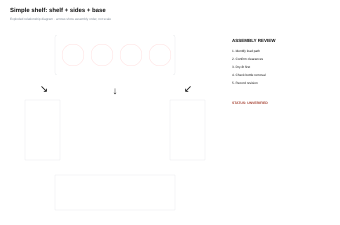
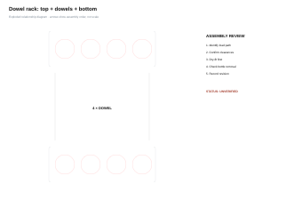
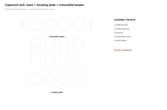
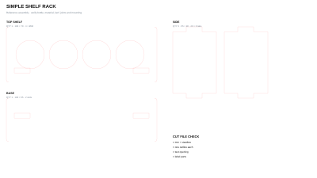
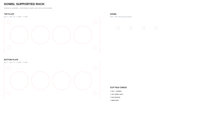
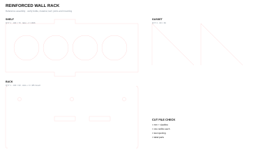
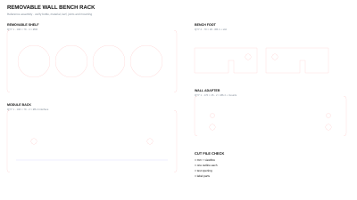
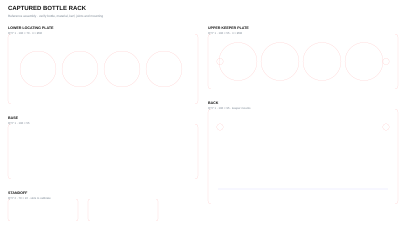

<nav class="ter-assembly-jump" aria-label="Choose an organizer assembly">
<a href="#simple-shelf-rack"><strong>A</strong> Simple shelf</a>
<a href="#dowel-supported-rack"><strong>B</strong> Dowel-supported</a>
<a href="#reinforced-wall-rack"><strong>C</strong> Reinforced wall</a>
<a href="#removable-wall-bench-rack"><strong>D</strong> Wall / bench</a>
<a href="#captured-bottle-rack"><strong>E</strong> Captured bottles</a>
</nav>

[Download all five assemblies + classroom files (ZIP)](../../../assets/laser-library/classroom-kit/technology-commons-first-laser-projects.zip){.btn .btn-primary} [View dimensions, BOMs + status (JSON)](../../../assets/laser-library/classroom-kit/pill-bottle/assemblies.json){.btn .btn-outline-secondary}

::: {.ter-project-brief}
## Design problem

Create an organizer for labelled shop pill bottles used to separate small fasteners or parts. The organizer should make contents visible, bottles easy to return and the storage location predictable. **Measure the actual classroom bottles.** The downloadable files use a documented example: 34 mm body, 42 mm cap, 36 mm opening and 42 mm centre spacing.
:::

The 36 mm opening allows the example body to pass through while the larger cap retains the bottle. That is a hypothesis to test, not a universal bottle size. Cut one opening coupon before a complete rack.

Use the [Fabrication Plate Builder](../../tools/plate-builder/index.qmd) to regenerate a measured row or grid, then follow [Material Fit + Calibration](../04-material-fit-calibration.qmd) before committing a full sheet.

## See and compare the five assemblies

::: {.callout-important}
## Ideas, not answers

These assemblies are deliberately different starting points. They show load paths, interfaces and service ideas; they do not tell you which organizer your space needs. Measure the bottles and the work area, select useful principles, then make and record your own tested revision.
:::

Each card shows both files you receive: the **exploded view** explains how the assembly goes together; the **parts sheet** is the true-size SVG students adapt in Inkscape. Select either preview to open it full size.

<article class="ter-assembly-card" id="simple-shelf-rack">
<a class="ter-assembly-preview ter-assembly-preview--hero" href="../../../assets/laser-library/classroom-kit/pill-bottle/simple-shelf-rack/exploded.svg">Exploded assembly</a>

A · Best first build

<h3>Simple shelf rack</h3>

Four laser-cut parts create the clearest load path: a perforated shelf, base and two tabbed sides.

<dl class="ter-assembly-facts">
<dt>Location</dt><dd>Bench</dd>

<dt>Parts</dt><dd>4</dd>

<dt>New idea</dt><dd>Tabs + slots</dd>
</dl>
<a class="ter-parts-preview" href="../../../assets/laser-library/classroom-kit/pill-bottle/simple-shelf-rack/parts.svg">True-size parts sheet</a>

<a class="btn btn-primary" href="../../../assets/laser-library/classroom-kit/pill-bottle/simple-shelf-rack/parts.svg" download>Download parts SVG</a><a class="btn btn-outline-secondary" href="../../../assets/laser-library/classroom-kit/pill-bottle/simple-shelf-rack/exploded.svg">Open exploded SVG</a>

<strong>Test:</strong> Is the shelf high enough to retain bottles but low enough for an easy lift?

</article>

<article class="ter-assembly-card" id="dowel-supported-rack">
<a class="ter-assembly-preview ter-assembly-preview--hero" href="../../../assets/laser-library/classroom-kit/pill-bottle/dowel-supported-rack/exploded.svg">Exploded assembly</a>

B · Hybrid fabrication

<h3>Dowel-supported rack</h3>

Two laser-cut plates are separated and aligned by four purchased dowels.

<dl class="ter-assembly-facts">
<dt>Location</dt><dd>Bench</dd>

<dt>Parts</dt><dd>2 cut + 4 dowels</dd>

<dt>New idea</dt><dd>Hole allowance</dd>
</dl>
<a class="ter-parts-preview" href="../../../assets/laser-library/classroom-kit/pill-bottle/dowel-supported-rack/parts.svg">True-size parts sheet</a>

<a class="btn btn-primary" href="../../../assets/laser-library/classroom-kit/pill-bottle/dowel-supported-rack/parts.svg" download>Download parts SVG</a><a class="btn btn-outline-secondary" href="../../../assets/laser-library/classroom-kit/pill-bottle/dowel-supported-rack/exploded.svg">Open exploded SVG</a>

<strong>Test:</strong> What dowel-hole allowance gives alignment without wobble?

</article>

<article class="ter-assembly-card" id="reinforced-wall-rack">
<a class="ter-assembly-preview ter-assembly-preview--hero" href="../../../assets/laser-library/classroom-kit/pill-bottle/reinforced-wall-rack/exploded.svg">Exploded assembly</a>

C · Load path study

<h3>Reinforced wall rack</h3>

A tabbed shelf meets a back plate; two gussets reinforce the joint. Wall hardware remains site-specific.

<dl class="ter-assembly-facts">
<dt>Location</dt><dd>Wall</dd>

<dt>Parts</dt><dd>4 + fasteners</dd>

<dt>New idea</dt><dd>Gussets + anchors</dd>
</dl>
<a class="ter-parts-preview" href="../../../assets/laser-library/classroom-kit/pill-bottle/reinforced-wall-rack/parts.svg">True-size parts sheet</a>

<a class="btn btn-primary" href="../../../assets/laser-library/classroom-kit/pill-bottle/reinforced-wall-rack/parts.svg" download>Download parts SVG</a><a class="btn btn-outline-secondary" href="../../../assets/laser-library/classroom-kit/pill-bottle/reinforced-wall-rack/exploded.svg">Open exploded SVG</a>

<strong>Test:</strong> Which approved wall, anchor and fastener system carries the complete load?

</article>

<article class="ter-assembly-card" id="removable-wall-bench-rack">
<a class="ter-assembly-preview ter-assembly-preview--hero" href="../../../assets/laser-library/classroom-kit/pill-bottle/removable-wall-bench-rack/exploded.svg">Exploded assembly</a>

D · Transferable module

<h3>Removable wall / bench rack</h3>

The same organizer body registers to either two bench feet or an approved wall adapter using two M6 hand knobs.

<dl class="ter-assembly-facts">
<dt>Location</dt><dd>Wall or bench</dd>

<dt>Parts</dt><dd>5 + hardware</dd>

<dt>New idea</dt><dd>Shared interface</dd>
</dl>
<a class="ter-parts-preview" href="../../../assets/laser-library/classroom-kit/pill-bottle/removable-wall-bench-rack/parts.svg">True-size parts sheet</a>

<a class="btn btn-primary" href="../../../assets/laser-library/classroom-kit/pill-bottle/removable-wall-bench-rack/parts.svg" download>Download parts SVG</a><a class="btn btn-outline-secondary" href="../../../assets/laser-library/classroom-kit/pill-bottle/removable-wall-bench-rack/exploded.svg">Open exploded SVG</a>

<strong>Test:</strong> Is the transfer interface obvious, stable and impossible to install backwards?

</article>

<article class="ter-assembly-card" id="captured-bottle-rack">
<a class="ter-assembly-preview ter-assembly-preview--hero" href="../../../assets/laser-library/classroom-kit/pill-bottle/captured-bottle-rack/exploded.svg">Exploded assembly</a>

E · Serviceable retention

<h3>Captured bottle rack</h3>

A lower plate locates each bottle body. A hand-knob-retained upper plate sits below the wider cap shoulder, resisting accidental lift while remaining removable for service.

<dl class="ter-assembly-facts">
<dt>Location</dt><dd>Bench / approved wall</dd>

<dt>Parts</dt><dd>6 cut + hardware</dd>

<dt>New idea</dt><dd>Removable keeper</dd>
</dl>
<a class="ter-parts-preview" href="../../../assets/laser-library/classroom-kit/pill-bottle/captured-bottle-rack/parts.svg">True-size parts sheet</a>

<a class="btn btn-primary" href="../../../assets/laser-library/classroom-kit/pill-bottle/captured-bottle-rack/parts.svg" download>Download parts SVG</a><a class="btn btn-outline-secondary" href="../../../assets/laser-library/classroom-kit/pill-bottle/captured-bottle-rack/exploded.svg">Open exploded SVG</a>

<strong>Service sequence:</strong> Support bottles → remove two knobs → lift keeper → replace bottles → refit keeper and knobs → record the revision.

<strong>Status:</strong> physically unverified. The keeper is not a child-resistant lock.

</article>

::: {.callout-note}
## What the downloads contain

- **Parts SVG:** true-size geometry in millimetres for editing, measuring and test cutting in Inkscape.
- **Exploded SVG:** assembly order and part relationships for discussion or projection.
- **Assembly manifest:** BOM, starting dimensions, interfaces, service record fields and physical-test status for all five systems.
- **Complete ZIP:** every organizer file plus the palettes, name-tag resources and individual components.
:::

## Bill-of-material and parameter routine

For any selected reference:

1. Measure at least three bottles: body diameter, cap diameter, height and any taper.
2. Choose the controlling diameter and required radial clearance.
3. Calculate `opening = largest measured body + 2 × radial clearance`.
4. Set centre spacing from cap diameter, hand access and remaining material—not appearance alone.
5. Update part dimensions and BOM before nesting.
6. Cut an opening coupon, record actual fit, then revise the source.
7. Dry-assemble; test insertion, removal, labels, tipping and collisions.

## Physical-test record

All five files currently have status **unverified**. Do not change that label because the SVG opens correctly. Record the material, measured thickness, machine, settings reference, date, tester, actual opening, fit result, load and revision before promoting a design to `fit-tested` or `shop-tested`.

## Reference systems worth studying

The sketches below are original Technology Commons diagrams, not copied product images. Follow each source to inspect the actual system and its licence. Borrow a principle only after checking dimensions, load, access, fabrication method and the source’s current terms.

<article class="ter-reference-card"><svg viewBox="0 0 180 90" role="img" aria-label="French cleat principle schematic"><path d="M15 25h150v12H15zm18 22h115l17 18H33z"/><path d="M65 47v28h70V47"/></svg><h3>French cleat</h3>
<strong>Principle:</strong> a continuous angled interface makes modules movable while the lower stand-off controls tilt.

<strong>Adapt:</strong> add an anti-lift or anti-slide feature where impact is possible.

Source: Wikipedia contributors · page content CC BY-SA · <a href="https://en.wikipedia.org/wiki/French_cleat">reference link</a> · original schematic here is AGPL-3.0 · reference only
</article>
<article class="ter-reference-card"><svg viewBox="0 0 180 90" role="img" aria-label="Gridfinity modular bin principle schematic"><path d="M18 62h144v15H18z"/><path d="M25 18h38v38H25zm46 0h38v38H71zm46 0h38v38h-38z"/><path d="M30 55l6 7h16l6-7m18 0l6 7h16l6-7m18 0l6 7h16l6-7"/></svg><h3>Gridfinity</h3>
<strong>Principle:</strong> a shared pitch lets containers move without redesigning the whole storage field.

<strong>Adapt:</strong> use a consistent centre spacing or interface datum across shop modules.

Source: Zack Freedman / Voidstar Lab and Kenneth Hodson’s rebuild · MIT · <a href="https://github.com/kennetek/gridfinity-rebuilt-openscad">reference link</a> · original schematic AGPL-3.0 · reference only
</article>
<article class="ter-reference-card"><svg viewBox="0 0 180 90" role="img" aria-label="openGrid mounting field schematic"><path d="M18 14h144v62H18z"/><g><circle cx="40" cy="33" r="7"/><circle cx="70" cy="33" r="7"/><circle cx="100" cy="33" r="7"/><circle cx="130" cy="33" r="7"/><circle cx="40" cy="61" r="7"/><circle cx="70" cy="61" r="7"/><circle cx="100" cy="61" r="7"/><circle cx="130" cy="61" r="7"/></g><path d="M92 25h42v36H92z"/></svg><h3>openGrid</h3>
<strong>Principle:</strong> a regular wall field separates the mounting interface from each accessory.

<strong>Adapt:</strong> document one interface and test light- and heavy-duty versions separately.

Source: David D / openGrid contributors · core parts CC BY · <a href="https://github.com/openGrid-3D/">reference link</a> · original schematic AGPL-3.0 · reference only
</article>
<article class="ter-reference-card"><svg viewBox="0 0 180 90" role="img" aria-label="Parametric pegboard holder schematic"><path d="M15 12h150v66H15z"/><g><circle cx="35" cy="30" r="3"/><circle cx="65" cy="30" r="3"/><circle cx="95" cy="30" r="3"/><circle cx="125" cy="30" r="3"/><circle cx="35" cy="60" r="3"/><circle cx="65" cy="60" r="3"/><circle cx="95" cy="60" r="3"/><circle cx="125" cy="60" r="3"/></g><path d="M57 25h50v37H57z"/><circle cx="72" cy="43" r="8"/><circle cx="94" cy="43" r="8"/></svg><h3>Pegstr</h3>
<strong>Principle:</strong> parametric holders begin with the object and the host-board standard.

<strong>Adapt:</strong> measure both; do not assume imported inch pegboard dimensions match local stock.

Source: MGX3D · CC BY-NC · <a href="https://github.com/MGX3D/pegstr">reference link</a> · original schematic AGPL-3.0 · reference only
</article>
<article class="ter-reference-card"><svg viewBox="0 0 180 90" role="img" aria-label="5S shadow-board schematic"><path d="M15 10h150v70H15z"/><path d="M40 24v37m-8-28h16m-12 28l-6 10m10-10l6 10M85 25v43m-10-35h20M128 22c15 0 18 18 4 22v27h-9V44c-14-4-11-22 5-22z"/></svg><h3>5S shadow board</h3>
<strong>Principle:</strong> a visible home position makes missing or misplaced items obvious.

<strong>Adapt:</strong> labels and silhouettes should support return, counting and inspection—not decoration.

Source: National Highways visual-management standard · Crown publication, linked for reference; no source media reused · <a href="https://nationalhighways.co.uk/media/b3yccpqy/visual-performance-management-minimum-standards.pdf">reference link</a> · original schematic AGPL-3.0 · reference only
</article>
<article class="ter-reference-card"><svg viewBox="0 0 180 90" role="img" aria-label="Flexible fabrication workshop zones schematic"><path d="M12 13h156v65H12zM22 23h58v20H22zm78 0h58v20h-58zM22 53h36v15H22zm46 0h36v15H68zm46 0h44v15h-44z"/><path d="M80 33h20m-10-7l10 7-10 7M58 60h10m36 0h10"/></svg><h3>Flexible fabrication workshop</h3>
<strong>Principle:</strong> organize around workflow, shared infrastructure and reconfigurable work zones.

<strong>Adapt:</strong> map where material arrives, work happens, parts wait and completed work leaves.

Source: Open Source Ecology contributors · open-source project; linked page terms govern reuse and no source media is copied · <a href="https://wiki.opensourceecology.org/wiki/FeF_Workshop">reference link</a> · original schematic AGPL-3.0 · reference only
</article>

::: {.callout-warning}
Wall mounting is not a decorative SVG problem. The wall substrate, anchor, fastener, backer, load, impact and inspection routine must be approved by the responsible instructor. A laser-cut plate is not a rated anchor.
:::
