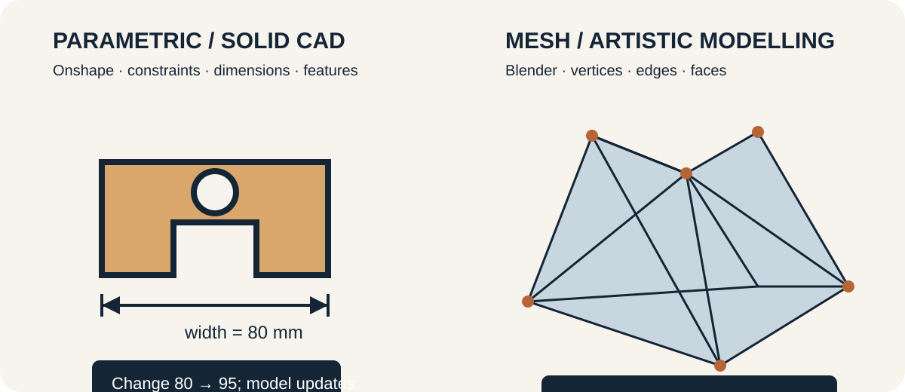

## Two useful modelling approaches

| Parametric / solid CAD | Mesh / artistic modelling |
|---|---|
| Sketches, constraints, dimensions and feature history describe design intent. | Vertices, edges and faces describe the visible surface. |
| Best default for holes, brackets, patterns, mating parts and predictable revision. | Excellent for organic, sculptural, character, rendering and animation work. |
| **Primary classroom tool: Onshape.** | **Primary artistic tool: Blender.** |

{.ter-concept-diagram}

Blender can make printable models, but it is not the default for dimension-driven mechanical or fabrication parts. Onshape is the primary fabrication-modelling tool because a student can change a dimension and inspect how the whole model updates.

## Additive manufacturing

Unlike subtractive processes that remove material or forming processes that reshape it, additive manufacturing creates a part layer by layer. The model must become a printable toolpath, so model, slicer, machine, material and orientation all influence the result.

## Model with intent

Begin from a measured need in **Onshape**. Use fully considered sketches, geometric constraints, exact dimensions and named variables where useful. Build features in a sequence another person can understand and revise.

Core operations include **extrude, remove, hole, fillet/chamfer, pattern and mirror**. Use each because it describes the intended geometry, not merely because it produces the visible shape once. Change one controlling dimension and confirm that related features update predictably.

## Keep the source; export for the next job

Editable source modelSTEP when solid interchange is neededSTL or 3MF for slicingSlicer project + toolpathPrinter

- **STEP** can transfer solid geometry between compatible CAD systems.
- **STL** carries a triangulated surface but normally no units, colour or feature history.
- **3MF** can carry units and richer manufacturing information; support depends on the software and printer workflow.

An exported mesh is not the editable master. Retain the Onshape document/source model and record which version produced the manufacturing file.

## First modelling task

Model a small identity badge or labelled spacer with controlled width, height, hole diameter, wall thickness and edge treatment. Use constraints rather than visual guessing. Change one parameter and confirm the model updates predictably. Export STL or 3MF for slicing while retaining the editable source.

## Model checks

- Is the body watertight and intended as one part or several?
- Are walls and small features plausible for the selected process?
- Can critical dimensions be traced to a measurement or requirement?
- Is the part oriented in CAD for clarity, even if print orientation changes later?
- Is the editable source saved alongside the exported manufacturing file?

::: {.ter-curriculum-relevance}
**Ontario curriculum relevance:** Supports **TDJ2O**, **TMJ2O**, **TIJ1O**, **TEJ2O**, and senior design/manufacturing learning involving CAD, geometric modelling, design communication, manufacturing preparation, and iteration.
:::

Next: [Slicing, Orientation & Supports](02-slicing-orientation.qmd).
