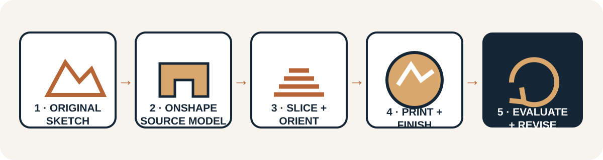
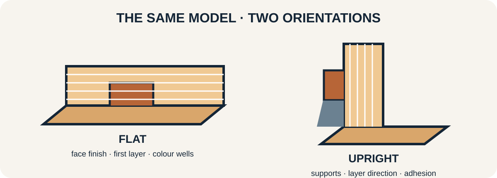

::: {.ter-project-brief}
## Design challenge

Create an original **pin, badge, pendant, charm or small teacher-approved wearable graphic**. Use a personal logo, a new symbol or another teacher-approved original design. Simplify it for small-scale production, model it parametrically in Onshape, print it, add colour/finish safely, evaluate it and revise the source model.
:::

## Inspiration, not an answer file

Study [Turn 3D Printed Faux Enamel Pins Into Unique Jewellery](https://www.instructables.com/Turn-3D-Printed-Faux-Enamel-Pins-Into-Unique-Jewel/) as a process reference. Do not reproduce the author's finished designs. Record the source, develop original artwork and follow local instructions for filament, adhesives, coatings, hardware, ventilation, curing and wearability.

{.ter-concept-diagram}

## Design-to-revision process

<ol class="ter-lesson-sequence">
  <li><strong>Sketch or choose an original graphic.</strong> State the meaning and intended wearer/viewer.</li>
  <li><strong>Simplify it for small-scale production.</strong> Remove tiny counters, narrow islands and details that will not survive printing or finishing.</li>
  <li><strong>Rebuild/model it parametrically in Onshape.</strong> Use constrained sketches and intentional dimensions instead of importing a finished 3D answer.</li>
  <li><strong>Create raised or recessed regions.</strong> Make boundaries appropriate for the intended visual effect and finishing process.</li>
  <li><strong>Confirm dimensions and thicknesses.</strong> Inspect overall size, base, details, holes and any attachment interface.</li>
  <li><strong>Export STL or 3MF.</strong> Retain the editable Onshape source and identify the exported version.</li>
  <li><strong>Slice.</strong> Inspect every layer, walls, top/bottom layers, infill, travel and estimated time/material.</li>
  <li><strong>Decide print orientation.</strong> Compare visual face quality, layer direction, supports, adhesion and strength.</li>
  <li><strong>Print.</strong> Follow approved printer, material and supervision procedures.</li>
  <li><strong>Finish and colour.</strong> Use only teacher-approved methods and allow coatings/adhesives to cure fully.</li>
  <li><strong>Evaluate.</strong> Check legibility, surface finish, colour boundaries, comfort, attachment and durability.</li>
  <li><strong>Revise the source model.</strong> Tie at least one change to measured or observed evidence.</li>
</ol>

## Minimum-detail and test strategy

Do not copy a universal minimum feature size. It depends on nozzle, layer height, orientation, material, slicer, finishing method and printer condition. Place several representative line widths, gaps or colour wells in a small test piece before committing to a full class batch.

{.ter-concept-diagram}

## Evidence to submit

- original sketches and source/licence notes;
- criteria and overall dimensions;
- Onshape source/version plus exported STL or 3MF;
- screenshot of constrained sketch and feature history;
- slicer preview and orientation justification;
- first print with observations;
- finishing/colour process notes;
- final evaluation and source-model revision.

::: {.callout-note}
## Wearable does not mean automatically safe

Teacher approval is required for attachment hardware and finishing materials. Remove sharp edges and fragile projections. Do not use a classroom prototype where failure, ingestion, skin sensitivity or entanglement could create a hazard.
:::

Review [Slicing, Orientation & Supports](02-slicing-orientation.qmd) and [Tolerances & Functional Parts](03-tolerances-functional-parts.qmd) as needed.
