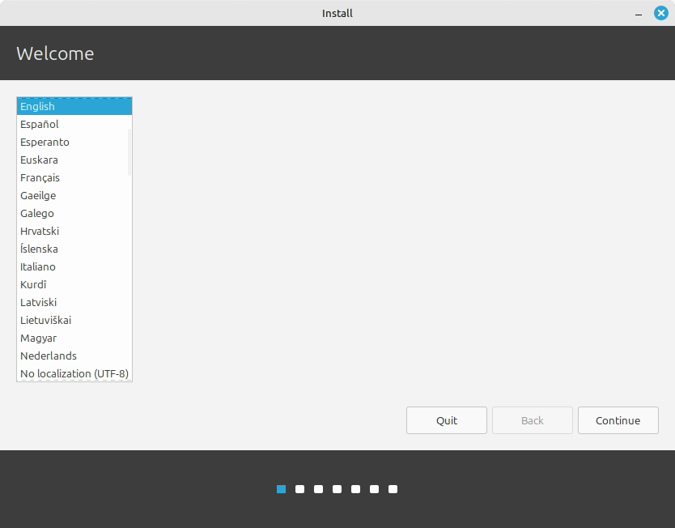
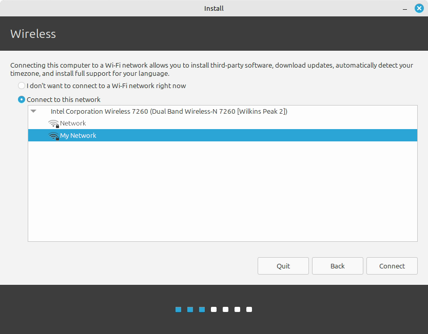
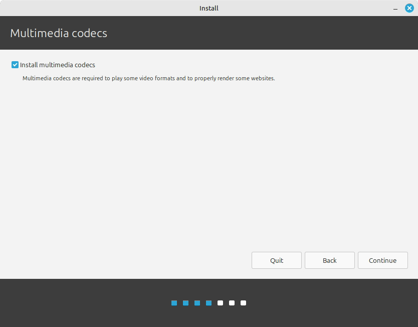
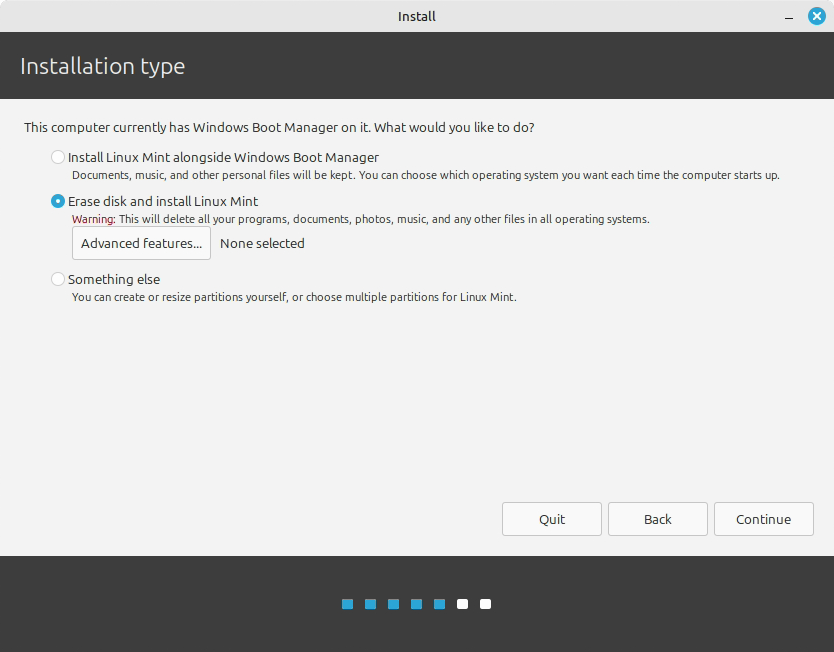
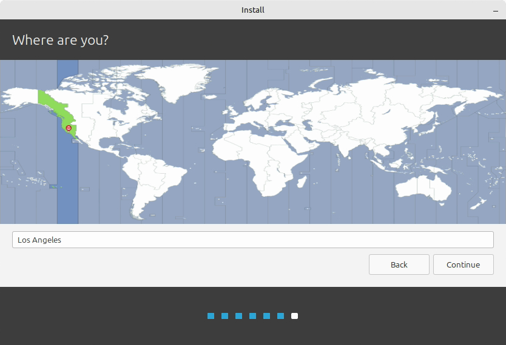
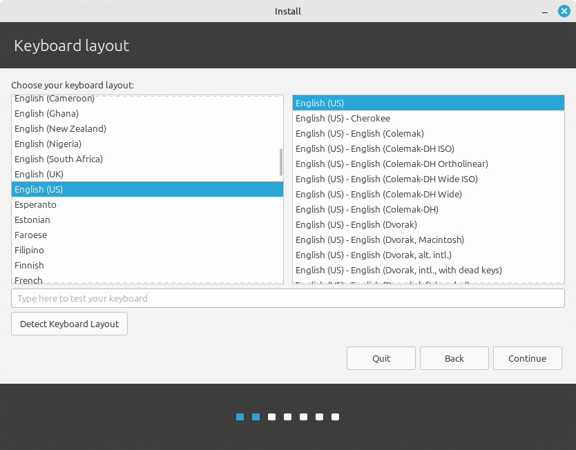
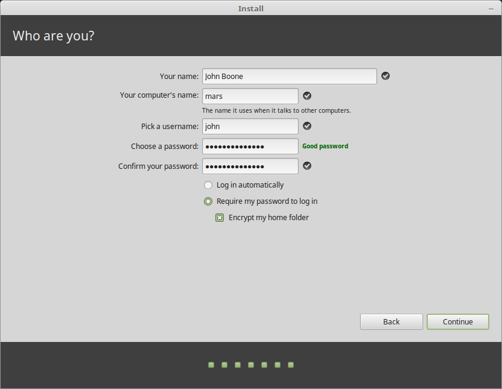
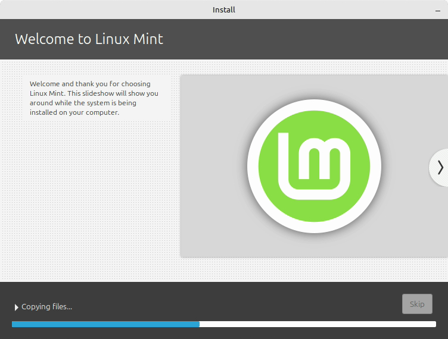
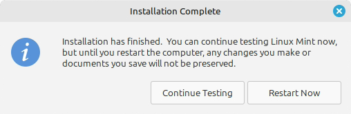

Linux Mint is a Linux operating system that usually **just works** and is easy for new users. We are installing **Linux Mint 22.3 “Zena” Xfce Edition**. Xfce has a familiar, classic Windows-like layout and uses fewer system resources, which makes it a good fit for our older computers with less than 8 GB of RAM.

::: {.callout-danger title="This lab erases the computer"}
Choose **Erase disk and install Linux Mint** only on the classroom computer assigned by your teacher. This deletes Windows, accounts, programs, and every file on the selected drive. Stop and ask your teacher before continuing if you are not certain that the computer and drive are approved.
:::

This classroom guide is adapted from the [official Linux Mint Installation Guide](https://linuxmint-installation-guide.readthedocs.io/en/latest/install.html). The installer screenshots come from that guide. Screens can change slightly between releases, and the example names or checkboxes shown in a screenshot may not match our required classroom settings. **Follow the written choices on this page.**

## Before you begin

You need:

- the assigned classroom computer;
- the Linux Mint 22.3 “Zena” Xfce USB installer supplied in class;
- the classroom Wi-Fi credentials; and
- your lab log.

Disconnect any personal USB drives or external storage. Have the teacher confirm the target computer before you erase anything.

## 1. Start the live system

Insert the Linux Mint USB drive and boot the computer from it. Choose the normal **Start Linux Mint** option if a startup menu appears. Linux Mint first opens a **live session**: a temporary desktop running from the USB drive.

The live session may feel slower than the finished installation, and changes made there are not permanent. If the live session asks for a password, leave it blank and press **Enter**.

Double-click **Install Linux Mint** on the desktop.

## 2. Choose the language

Select **English**, then select **Continue**.

{fig-alt="Linux Mint installer language screen with English selected"}

## 3. Connect to the classroom Wi-Fi

Select the classroom network and connect using the Wi-Fi credentials given in class.

::: {.callout-warning title="Do not use guest Wi-Fi"}
Do **not** use the guest Wi-Fi. Use only the classroom Wi-Fi credentials provided by your teacher.
:::

{fig-alt="Linux Mint installer wireless network selection screen"}

## 4. Install multimedia codecs

Check **Install multimedia codecs**, then select **Continue**. Codecs help the computer play common audio and video formats.

{fig-alt="Linux Mint installer option to install multimedia codecs"}

## 5. Choose the installation type

Select **Erase disk and install Linux Mint**.

- Leave **Advanced features** at its default setting with **None selected**. We can explore advanced storage settings in a later lab.
- Do **not** select an encryption option for this classroom installation.
- Do **not** select **Something else**.
- Do **not** select an “install alongside” option in this lab.

{fig-alt="Linux Mint installation type screen with Erase disk and install Linux Mint selected"}

Select **Install Now** or **Continue**, depending on the wording shown. Read the drive-change summary, confirm that it refers to the approved classroom drive, and then continue.

In a future lab, we will install another operating system alongside Windows and create a **dual-boot** computer. That is not today’s task.

## 6. Set the time zone

Choose **Toronto**, then select **Continue**.

{fig-alt="Linux Mint installer time zone screen"}

## 7. Set the keyboard layout

Choose **English (US)** for the keyboard layout. Do **not** choose English (Canadian). Use the test box to check a few letters, numbers, and punctuation marks, then select **Continue**.

{fig-alt="Linux Mint installer keyboard layout screen"}

## 8. Create the classroom account

Enter the following settings exactly, except for the computer name:

| Installer field | Classroom setting |
|:--|:--|
| Your name | `min` |
| Your computer's name | Create a unique, school-appropriate name |
| Pick a username | `min` |
| Choose a password | `pcss` |
| Confirm your password | `pcss` |
| Login choice | **Require my password to log in** |
| Encrypt my home folder | **Leave unchecked** |

Use only lowercase letters, numbers, and hyphens in the computer name, with no spaces. A name such as `min-tej-14` is clear and easy to record. Your name must be unique in the classroom.

::: {.callout-important title="Use the table, not the sample data in the screenshot"}
The official screenshot shows example names and shows home-folder encryption selected. For this lab, use `min`, your unique computer name, the classroom password, **Require my password to log in**, and **do not encrypt the home folder**. The password `pcss` is for this classroom image only; never reuse it for a personal account.
:::

{fig-alt="Linux Mint installer user account screen"}

Select **Continue** to begin the installation.

## 9. Explore safely while the installer works

The installation slideshow will run while files are copied.

{fig-alt="Linux Mint installation slideshow while files are copied"}

Without closing the installer:

1. Open the web browser.
2. Visit the [TEJ Notes website](https://andrewandrade.ca/tech-edu-resources/tej3-4/) and record whether it loads.
3. Open the main menu and find the **Software Manager**—Linux Mint’s “app store.” Search for `games` and record one school-appropriate game or application that looks interesting.
4. Find the File Manager and Terminal icons. You do not need to run commands yet.

Software installed during the live session may disappear after restart, so wait until the finished system starts before installing your chosen application.

## 10. Restart into the installed system

When the installer reports that it is finished, select **Restart Now**.

{fig-alt="Linux Mint installation complete screen with Restart Now"}

Remove the USB drive when the computer asks, then press **Enter**. Log in as `min` using the classroom password `pcss`.

## 11. Test the new installation

1. Open the browser and confirm that the [TEJ Notes website](https://andrewandrade.ca/tech-edu-resources/tej3-4/) still loads.
2. Open **Software Manager** from the main menu.
3. Search for `games` or search for the application you recorded earlier.
4. With teacher approval, install one school-appropriate game or useful application. Record its exact name.
5. Open the application once to confirm that it works.

If you finish early, choose one optional challenge:

- change the desktop wallpaper or panel appearance without hiding essential controls;
- find the system-information screen and record the computer’s RAM;
- take a screenshot of your finished desktop;
- find one accessibility setting that could make the computer easier for someone to use; or
- compare the Linux desktop with Windows and list one similarity and one difference.

## Lab log

Record the following in your lab log before you leave:

| Prompt | Your evidence |
|:--|:--|
| Computer name | |
| Did the TEJ Notes website load? | |
| Game or software installed | |
| One thing I like | |
| One thing I do not like yet | |
| One thing I want to learn more about | |
| One difference I noticed between Linux Mint and Windows | |
| Optional discovery or customization | |

Show the installed system and completed lab log to your teacher.

## Sources and image credit

- [Linux Mint Installation Guide: Install Linux Mint](https://linuxmint-installation-guide.readthedocs.io/en/latest/install.html)
- [Linux Mint 22.3 “Zena” editions](https://linuxmint.com/download.php/)
- [Linux Mint FAQ: use of Linux Mint screenshots](https://www.linuxmint.com/faq.php)

Linux Mint project screenshots are reproduced for this educational installation guide. This site is not affiliated with or endorsed by Linux Mint.
