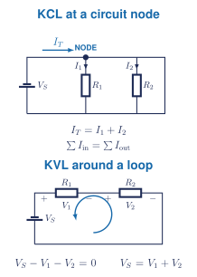

## Learning goals

**I will be able to** apply Kirchhoff's current law at a node and Kirchhoff's voltage law around a loop.

**This is useful because I can** write equations for a circuit that cannot be reduced by inspection.

**Used in college or university:** Nodal analysis, mesh analysis, electronics, power systems, and control hardware. [[1, Ch. 9]](../../references.qmd#ref-grob2016)

**Where you see it:** In a car wiring harness, current splits between lights, sensors, and control modules before returning to the battery. In a robot, Kirchhoff's laws describe the same splits and voltage changes between the controller, sensors, and motors.

## Kirchhoff's current law

<figure class="ter-circuit-figure" id="fig-kirchhoff-node-loop">

<figcaption><a class="ter-figure-label" href="#fig-kirchhoff-node-loop">Figure 1.</a> A node is a real junction in the schematic. A loop is a complete closed path. <a class="ter-figure-anchor" href="#fig-kirchhoff-node-loop" aria-label="Link to Figure 1">#</a></figcaption>
</figure>

Charge does not accumulate at an ideal node:

$$
\sum I_{\mathrm{in}} = \sum I_{\mathrm{out}}
$$ {#eq-kirchhoff-current}

Equivalently, using one consistent sign convention:

$$
\sum_{k=1}^{n} I_k = 0
$$ {#eq-kirchhoff-current-signed}

An assumed current direction is allowed. A negative answer means the real direction is opposite to the arrow you selected.

## Kirchhoff's voltage law

The algebraic sum of voltage changes around a closed loop is zero:

$$
\sum_{k=1}^{n}\Delta V_k = 0
$$ {#eq-kirchhoff-voltage}

Choose a loop direction and keep the sign convention consistent. Crossing a source from negative to positive is a rise; crossing a resistor in the direction of current is a drop.

## From a circuit to equations

1. Mark the essential nodes and independent loops.
2. Choose and label unknown current directions.
3. Write current-law equations at the nodes.
4. Write voltage-law equations around independent loops.
5. Replace resistor voltages with Ohm's law:

$$
V_R = IR
$$ {#eq-kirchhoff-ohms-law}

6. Solve the simultaneous equations created with Equations @eq-kirchhoff-current and @eq-kirchhoff-voltage.
7. Substitute the answers back into the original node and loop equations.

## Course-material status

The website notes are available now. The teaching slides and five-question sheet are the next implementation package in the sequence.

Chapter 9 can follow Chapter 6. Teach the relevant digital-multimeter safety from Chapter 8 before students make physical measurements.
