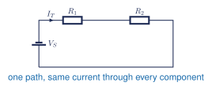

## Learning goals

**I will be able to** identify a series circuit and calculate its total resistance, current, voltage drops, and power.

**This is useful because I can** predict every electrical value before building the circuit and check whether my measurements make sense.

**Used in college or university:** Direct-current circuit analysis, electrical laboratories, instrumentation, and introductory electronics. [[1, Ch. 4]](../../references.qmd#ref-grob2016)

**Where you see it:** In a car, a switch, fuse, and lamp can form one current path. In a robot, a battery, current-limiting resistor, and status light form the same kind of series path.

## One path

A series circuit has one continuous current path. Opening any part stops current everywhere.

<figure class="ter-circuit-figure" id="fig-series-rule">

<figcaption><a class="ter-figure-label" href="#fig-series-rule">Figure 1.</a> Series-circuit reference schematic. The same current passes through every component. <a class="ter-figure-anchor" href="#fig-series-rule" aria-label="Link to Figure 1">#</a></figcaption>
</figure>

The same current passes through every component:

$$
I_k = I_T
$$ {#eq-series-current}

Here, $k$ represents any component in the series path.

## General series rules

Series resistances add:

$$
R_T = \sum_{k=1}^{n} R_k
$$ {#eq-series-resistance}

The source voltage equals the sum of the voltage drops:

$$
V_T = \sum_{k=1}^{n} V_k
$$ {#eq-series-voltage}

Total power equals the sum of the component powers:

$$
P_T = \sum_{k=1}^{n} P_k = V_T I_T
$$ {#eq-series-power}

After finding $R_T$, calculate the circuit current with Ohm's law:

$$
I_T = \frac{V_T}{R_T}
$$ {#eq-series-total-current}

Then calculate any component voltage drop:

$$
V_k = I_T R_k
$$ {#eq-series-component-voltage}

## Voltage divider

For an unloaded series voltage divider, the voltage across any resistor is

$$
V_k = V_T\frac{R_k}{R_T}
$$ {#eq-series-divider}

Equation @eq-series-divider is a shortcut derived from Ohm's law. It does not replace Equations @eq-series-current, @eq-series-resistance, and @eq-series-voltage.

## Check the answer

$$
\sum_{k=1}^{n} V_k \overset{?}{=} V_T
$$ {#eq-series-voltage-check}

Also confirm that the units are correct, the current is identical everywhere, and the component powers do not exceed their ratings.

## Notes, slides, and question sheet

- [Series Circuits A teaching slides](https://docs.google.com/presentation/d/1CQf3eYAcKw6tf2J7BCa38cskxnGP0T3fjBaxnLKbx-o/edit)
- [Series Circuits A student question sheet](https://docs.google.com/document/d/1KMKU3e4OkKn40jMy5KeyGHXKcn2IftQcRiNggfYHivc/edit)
- [Electronics formula and calculator reference](https://docs.google.com/document/d/1DyGsEwpLrrwSRnyMXN5kze2qRYFoAY2t-P09wnfUS6c/edit)
- [Complete Series Circuits lesson package](../electronics-library/modules/h09-series-circuits-a.qmd)

The teacher answer key is restricted.
