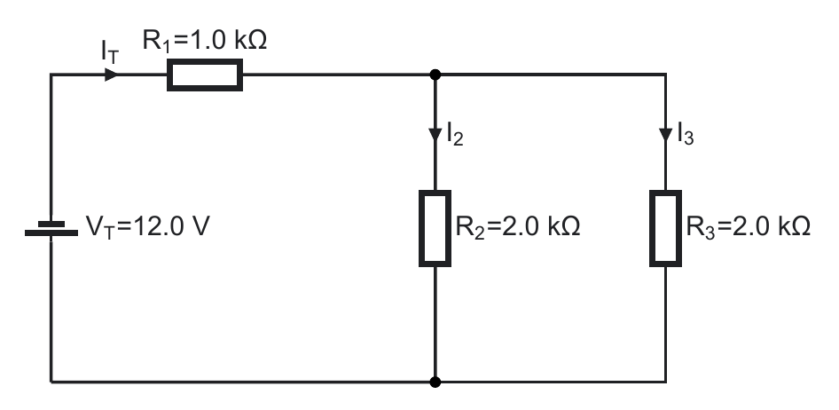

## Learning goals

**I will be able to** identify series and parallel groups, redraw a circuit, reduce it step by step, solve the equivalent circuit, and work back to the original branches.

**This is useful because I can** turn a complicated network into smaller problems and check the final result.

**Used in college or university:** Network reduction, circuit laboratories, electronics, instrumentation, and preparation for Kirchhoff analysis. [[1, Ch. 6]](../../references.qmd#ref-grob2016)

**Where you see it:** A car uses a fuse and switch in series with parallel lamps or control modules. A robot uses the same pattern when one protected supply feeds several sensors while each indicator light has its own series resistor.

## Identify the connections

Components are in series when the same current must pass through them. Components are in parallel when both ends connect to the same two nodes.

Do not decide from appearance alone. Trace the nodes and current paths.

<figure class="ter-circuit-figure" id="fig-series-parallel-comparison">

<figcaption><a class="ter-figure-label" href="#fig-series-parallel-comparison">Figure 1.</a> Use nodes and current paths, not visual appearance, to identify series and parallel connections. <a class="ter-figure-anchor" href="#fig-series-parallel-comparison" aria-label="Link to Figure 1">#</a></figcaption>
</figure>

## Reduction equations

For a series group:

$$
R_{\mathrm{series}} = \sum_{k=1}^{n}R_k
$$ {#eq-mixed-series-resistance}

For a parallel group:

$$
\frac{1}{R_{\mathrm{parallel}}}
= \sum_{k=1}^{n}\frac{1}{R_k}
$$ {#eq-mixed-parallel-resistance}

For exactly two resistors in parallel:

$$
R_{\mathrm{parallel}}
= \frac{R_aR_b}{R_a+R_b}
$$ {#eq-mixed-two-resistors}

Equations @eq-mixed-series-resistance and @eq-mixed-parallel-resistance are applied one group at a time. Redraw the complete circuit after every reduction.

<figure class="ter-circuit-figure" id="fig-series-parallel-example">

<figcaption><a class="ter-figure-label" href="#fig-series-parallel-example">Figure 2.</a> Canonical mixed network used in the teaching slides and question sheet. <a class="ter-figure-anchor" href="#fig-series-parallel-example" aria-label="Link to Figure 2">#</a></figcaption>
</figure>

## Solve in two directions

### Reduce toward the source

1. Mark one true series or parallel group.
2. Replace it with its equivalent resistance.
3. Redraw the complete circuit.
4. Repeat until only $R_T$ remains.
5. Calculate total current:

$$
I_T = \frac{V_T}{R_T}
$$ {#eq-mixed-total-current}

### Expand back to the branches

Work backward through the redraws. Apply the series rule when current is common and the parallel rule when voltage is common.

For any resistor:

$$
V_k = I_kR_k
$$ {#eq-mixed-ohms-law}

For the entire network:

$$
P_T = V_TI_T = \sum_{k=1}^{n}P_k
$$ {#eq-mixed-power}

## Check the answer

At every node:

$$
\sum I_{\mathrm{in}} \overset{?}{=} \sum I_{\mathrm{out}}
$$ {#eq-mixed-current-check}

Around every complete path:

$$
\sum \Delta V \overset{?}{=} 0
$$ {#eq-mixed-voltage-check}

Use Equations @eq-mixed-current-check and @eq-mixed-voltage-check to check the network. Also confirm the total power equals the sum of the component powers.

## Notes, slides, and question sheet

- [Series-Parallel Circuits A teaching slides](https://docs.google.com/presentation/d/177liW0qHi3201A6RaZl1r-xWMSVoo0rhj-a9np2jsoQ/edit)
- [Series-Parallel Circuits A student question sheet](https://docs.google.com/document/d/1dGTCgCEVFoxy-M1k4z1qiO31_7Wke69xmd51EnQCGUA/edit)
- [Electronics formula and calculator reference](https://docs.google.com/document/d/1DyGsEwpLrrwSRnyMXN5kze2qRYFoAY2t-P09wnfUS6c/edit)
- [Complete Series-Parallel Circuits lesson package](../electronics-library/modules/h11-series-parallel-circuits-a.qmd)

The teacher answer key is restricted.
